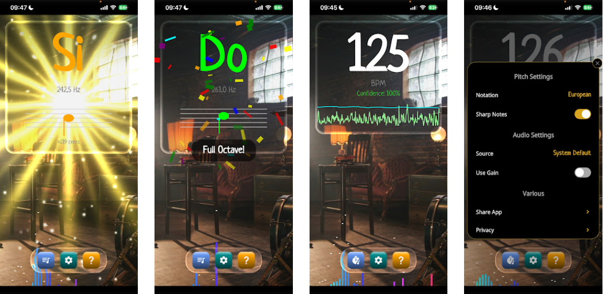

# Building SolTempo: Realtime Audio Processing and Shaders in .NET MAUI

This article is about **realtime audio processing and analysis in .NET MAUI**, while making an attractive UI with SKSL shaders, transitions and effects.

Recent enhancements shipped for DrawnUI’s `SkiaCamera` control (realtime video + audio processing) made this possible. I will touch video processing with realtime encoding in the next article, meanwhile let’s have some fun with the audio: our control can also work in audio-only monitoring mode without video capabilities.

[SolTempo](https://github.com/taublast/SolTempo) open-source .NET MAUI app for iOS, Mac Catalyst, Android, and Windows does realtime note pitch+BPM detection and showcases a clean, cross-platform audio pipeline:

- capture mic audio in a simple way
- apply optional transforms (Gain +5 in this app, it could be anything: voice changer, EQ, noise gate…),
- analyze audio samples (notes / BPM)
- render visuals from that state

Another motivation for building this (took about a week) app was to bring out another SKSL shaders use case for .NET MAUI, like creating a liquid glass simulation and some more. This kind of “everything can be drawn with Skia” is often associated with Flutter, but SkiaSharp makes it possible for .NET MAUI to play in the same league.



## SolTempo Features (Quick Overview)

Here is what the app does:

- Real-time note pitch detection for voice and instruments
- Tuning indicator: shows how sharp/flat you are relative to the nearest semitone
- Multiple note notations: Letters, Solfeggio (fixed/movable), Cyrillic, Numbers
- Optional semitones (C#, Eb, etc.) or “natural notes only” mode
- BPM / tempo detection (roughly 40–260 BPM)
- Audio settings: choose input device (or System Default) and enable Gain (+5) for low signals
- Streak achievements ("Full Octave" / "Perfect Streak") with confetti and a fullscreen shader celebration

## The Single Canvas Approach

Like many of my previous MAUI apps, SolTempo is completely drawn on a single hardware-accelerated SkiaSharp-backed `Canvas`. The other native control we use is the one presented via `DisplayActionSheet` — love using this one to keep platform-native feel for users.

All the navigation, modals, and popups happen inside the canvas. To make the UI feel pleasant SolTempo uses:

- shader-based transitions when switching modules
- shaders for entrance/exit of popups instead of usual scale/fade transforms
- a dynamic liquid glass-like shader backdrop behind the main panel
- a dynamic liquid glass-like shader backdrop behind the bottom icons menu panel
- a constantly drawn audio equalizer at the bottom
- a simple confetti helper when you hit a "Full Octave" streak
- a neat animated shader for the "Perfect Streak" achievement

The UI itself is assembled in code (.NET HotReload-friendly), no XAML this time, and uses DrawnUI for layouts, gestures, shaders etc.

For example creating the liquid glass panel behind the notes module looks like this:

```csharp
new SkiaBackdrop()
{
	HorizontalOptions = LayoutOptions.Fill,
	VerticalOptions = LayoutOptions.Fill,
	Blur = 0,
	VisualEffects = new List<SkiaEffect>
	{
		new GlassBackdropEffect()
		{
			EdgeOpacity = 0.55f,
			EdgeGlow = 0.95f,
			Emboss = 9.2f,
			BlurStrength = 1.0f,
			Opacity = 0.9f,
			Tint = Colors.Black.WithAlpha(0.33f),
			CornerRadius = 24,
			Depth = 1.66f
		}
	}
}
```

The backdrop captures the background, a custom visal effect applies a shader to it. You can easily create your effects from scratch or subclassing some of the existing. The `GlassBackdropEffect` took a `SkiaShaderEffect` and wired up some custom properties on top for use with the `glass.sksl` shader shipped inside the `Resources\Raw` MAUI app folder.

## Realtime Audio with SkiaCamera

If you’ve seen previous camera/shader experiments (like [Filters Camera](../FiltersCamera/)), you might already know `SkiaCamera` control. But SolTempo uses it in a slightly different way: **audio-only monitoring**.

`SkiaCamera` can provide incoming audio buffers directly, so we can build a deterministic, cross-platform audio pipeline on top of it. The app continuously captures the audio feed, applies transforms if needed (like an optional +5 audio gain boost for low signals), and analyzes the samples to detect pitch or compute the BPM. Everything is processed on-device and then fed straight into UI visualizers.

### Audio-only mode

SolTempo defines a tiny `SkiaCamera` subclass that disables video and enables audio monitoring:

```csharp
public partial class AudioRecorder : SkiaCamera
{
	public AudioRecorder()
	{
        // flags for permissions that will be required when turning control On.
		NeedPermissionsSet = NeedPermissions.Microphone;

		// turn on AUDIO recorder mode
		EnableAudioMonitoring = true;
		EnableAudioRecording = true;

		// turn off VIDEO
		EnableVideoPreview = false;
		EnableVideoRecording = false;
	}

	public float GainFactor { get; set; } = 5.0f;
	public bool UseGain { get; set; }

    // this is where you can hook whatever processing you want
	protected override AudioSample OnAudioSampleAvailable(AudioSample sample)
	{
		if (UseGain && sample.Data != null && sample.Data.Length > 1)
		{
			// Amplify PCM16 audio data in-place, no allocations
			AmplifyPcm16(sample.Data, GainFactor);
		}

		OnAudioSample?.Invoke(sample);
		return base.OnAudioSampleAvailable(sample);
	}
}
```

Notice that in SolTempo we do not record (save audio to disk), we stick to monitoring + analysis. But in case you were recording, processing hook `OnAudioSampleAvailable` would be also used to transform audio before it would go to realtime audio encoder.

Now that the sample is ready to be consumed:

```csharp
//we hooked Recorder.OnAudioSample += OnAudioSample;
// now a sample that passed through processing comes in
private void OnAudioSample(AudioSample sample)
{
	// notes detector module
	if (_musicNotesWrapper.IsVisible)
		NotesModule.AddSample(sample);

	// our BPM module
	if (_musicBPMDetectorWrapper.IsVisible)
		_musicBPMDetector?.AddSample(sample);

	// EQ drawn on bottom
	if (_equalizer.IsVisible)
		_equalizer.AddSample(sample);
}
```

As audio analysis could easily become a deep subject, let's now focus on modules rendering.

## Rendering Modules

After we analyzed the data received via `AddSample` we need to paint our UI to show results to the user. We use DrawnUI for NET MAUI to be able to unleash the power of SkiaSharp for rendering UIs. It brings is i'ts own `Canvas` handlers (adapted for UI rendering, fps-control, display sync) and a comfortable to use WPF/MAUI-like layout system along with gestures support and much more.

So in SolTempo modules can access SkiaSharp canvas to draw anything in to main ways, and mix them freely:

- **DrawnUI controls** (`SkiaLabel`, `SkiaShape`, layouts) for everything that feels like UI
- **Direct SKCanvas painting** for “pure drawing” like waveforms, EQ shapes etc...

### Use Drawn Controls

A DrawnUI control is drawn on every frame when it and all of its parents are not cached or it's cache is invalidated with an `Update()`. Why caching? Intead of drawing/calculating layouts/shadows/fonts etc on every frame we can fast draw either a pre-rendered bitmap (`SkImage`) or a previously recorded set of drawing operations (`SkPicture`). Using caching properly can make DrawnUI to practically operate in **retained mode**.

A cached control will be invalidated when some child property changes, for example a `Text` property of a `SkiaLabel `, or an `Update` was called to ivalidate cache. So we have to invalidate manualy in case we processed audio and we want to draw **changed** visual EQ graphic. Otherwise the control representing an audio module or even its top parent would just be fast drawn from cache or even better: not invalidating the `Canvas` at all if other controls didn't change either. The app canvas redraws only if something really changed, contrary to the usual SkiaSharp usage flow.

Speaking of example, the module detecting BPM is created as follows:

```csharp
public AudioMusicBPM()
{
    UseCache = SkiaCacheType.Operations;

    Children = new List<SkiaControl>
    {
        new SkiaLabel
        {
            FontSize = 140,
            //MonoForDigits = "8", <-- this would make font act as mono, digits will take width of "8" and text will not "jump" when number changes, might useful for HUDs etc. We don't use this on purpose here to get a more vivid and less "toolish" look.
            CharacterSpacing = 5.0,
            IsParentIndependent = true,
            Margin = new (2,16),
            MaxLines = 1,
            LineBreakMode = LineBreakMode.CharacterWrap,
            UseCache = SkiaCacheType.Operations,
            FontAttributes = FontAttributes.Bold,
            FontFamily = AppFonts.Default,
            TextColor = Colors.White,
            HorizontalOptions = LayoutOptions.Center,
        }.Assign(out _labelBpm),

        new SkiaLabel
        {
            Text = "BPM",
            Margin = new(0,150,0,0),
            FontSize = 24,
            FontFamily = AppFonts.Default,
            TextColor = Colors.Gray,
            HorizontalOptions = LayoutOptions.Center,
            UseCache = SkiaCacheType.Operations,
        }.Assign(out _labelBpmUnit),

        new SkiaLabel
        {
            FontSize = 19,
            Margin = new(0,180,0,0),
            FontFamily = AppFonts.Default,
            TextColor = Colors.LimeGreen,
            HorizontalOptions = LayoutOptions.Center,
            UseCache = SkiaCacheType.Operations,
        }.Assign(out _labelConfidence),

        new SkiaLabel
        {
            Margin = new Thickness(16,40),
            Text = "Tap to reset BPM metering",
            FontSize = 22,
            FontFamily = AppFonts.Default,
            TextColor = Colors.LightGray,
            VerticalOptions = LayoutOptions.Start,
            HorizontalOptions = LayoutOptions.Center,
            UseCache = SkiaCacheType.Operations,
            IsVisible = true,
        }.Assign(out _labelNoSignal),

    };
}

```

You could also use XAML too for DrawnUI as demonstrated by other articles/apps, today i am mainly [using code-behind](https://drawnui.net/articles/fluent-extensions.html), i love how .NET HotReload works with this approach. 

<TODO>
insert gif video of hotreload in action
</TODO>

And let's not forget about gestures:

```csharp
        public override ISkiaGestureListener ProcessGestures(SkiaGesturesParameters args, GestureEventProcessingInfo apply)
        {
            if (args.Type == TouchActionResult.Tapped)
            {
                Reset(); //reset our audio module to start analysing from scratch
                return this; //this means "who consumed the gesture"
            }
            return base.ProcessGestures(args, apply); //would return null or one of the possible children if they consume anything
        }
```

### Access Canvas DIrectly

We can override the main painting method of any `SkiaControl` to access the drawing surface:

```csharp

protected override void Paint(DrawingContext ctx)
    {
        base.Paint(ctx); //background + changed children, like our labels etc, will be painted automatically inside

        //we have total access to SkiaSharp canvas to draw EQ lines etc, all data we might need is:
        var canvas = ctx.Context.Canvas; //SkCanvas
        float scale = ctx.Scale; //density, how many pixels in one point
        SKRect destination = this.DrawingRect; //in pixels, after measure/arrange
            
        //an example of a usual SkiaSharp primitive:
        canvas.DrawOval(destination.Width/2.0f, destination.Height/2.0f, 15 * scale, 11 * scale, somePaint); //if we use scale it will look same size on any device/platform
    }

```

## Shaders Everywhere

One of the most interesting parts of SolTempo is the heavy use of SKSL shaders. Instead of basic static backgrounds or standard MAUI animations, we rely on the GPU.

This is also where the “single canvas” approach shines. You are not animating a pile of native views — you are drawing a scene. That makes it much easier to mix realtime audio analysis and realtime shaders without getting surprised by layout overhead or GC spikes.

### Liquid Glass Backdrop
Behind the main interface, there is a realtime SKSL shader rendering a liquid glass-like effect. It gives the app a very distinct, modern look that reacts smoothly without taxing the CPU.

This is implemented as a `GlassBackdropEffect` (a small wrapper around `SkiaShaderEffect`) that binds a bunch of uniforms like corner radius, emboss/refraction, edge glow, and tint:

```csharp
public class GlassBackdropEffect : SkiaShaderEffect
{
	public GlassBackdropEffect()
	{
		ShaderSource = @"Shaders\\glass.sksl";
	}

	protected override SKRuntimeEffectUniforms CreateUniforms(SKRect destination)
	{
		var uniforms = base.CreateUniforms(destination);
		var scale = Parent?.RenderingScale ?? 1f;

		uniforms["iCornerRadius"] = CornerRadius * scale;
		uniforms["iEmboss"] = Emboss;
		uniforms["iDepth"] = Depth;
		uniforms["iBlurStrength"] = BlurStrength;
		uniforms["iOpacity"] = Opacity;
		uniforms["iEdgeOpacity"] = EdgeOpacity;
		uniforms["iEdgeGlow"] = EdgeGlow;
		uniforms["iTint"] = new float[] { (float)Tint.Red, (float)Tint.Green, (float)Tint.Blue, (float)Tint.Alpha };

		return uniforms;
	}
}
```

### Animated Popups and Achievements
When you hit a streak of correct notes (full octave, and then a longer “perfect streak”), the app triggers encouraging effects. We used animated shaders to handle the appear and exit transitions of popups, as well as the achievement visual effects. Using shaders for these animations keeps the framerate high even when the audio processing is working hard in the background.

There are two fun bits here:

1. **Shader transition when switching modules**. This is a single-texture transition shader driven by a progress animator. At progress `0.5` the screen is fully hidden, we swap the module, then the reveal phase shows the new state:

```csharp
var fx = new TransitionEffect();
fx.Midpoint += (s, e) =>
{
	ToggleVisualizerMode();
	fx.AquiredBackground = false;
};
fx.Completed += (s, e) =>
{
	_mainStack.VisualEffects.Remove(fx);
	_mainStack.DisposeObject(fx);
};

_mainStack.VisualEffects.Add(fx);
fx.Play();
```

2. **Achievement fullscreen celebration**. When the notes sequence tracker reports a “Perfect Streak” we add a fullscreen `AchievementEffect` shader (and remove it when done):

```csharp
var fx = new AchievementEffect();
fx.Completed += (s, e) =>
{
	_background.VisualEffects.Remove(fx);
	_background.DisposeObject(fx);
};

_background.VisualEffects.Add(fx);
fx.Play();
```

There is also a simple “confetti helper” for the first achievement, because you can’t ship a music practice app without confetti 😄.

## Built-in Live Shader Editor

Writing SKSL shaders can be a trial-and-error process. To speed this up, I included a built-in shader live editor that runs when the app is compiled for Windows. 

This means you can tweak the SKSL code inside the app, hit save, and instantly see the liquid glass background or the popup transition change in real-time. No need to recompile or restart the app.

In SolTempo this is wired as a debug-only developer feature: on Windows, tapping **Settings** opens a separate window with the editor, preloaded with the current shader code.

The important trick is that we stop loading the shader from file and replace it with in-memory code:

```csharp
public void ChangeShaderCode(string code)
{
	if (_editableShader == null)
		return;

	_editableShader.ShaderSource = null; // do not load from file anymore
	_editableShader.ShaderCode = code;   // set our own code
}
```

It’s a very simple workflow, but for shader tuning it feels like cheating.

## Final Thoughts

SolTempo is not “the ultimate tuner” and not “the ultimate BPM detector”. It’s a compact playground that demonstrates a workflow I really like:

- capture realtime audio,
- optionally process it (Gain, filters, whatever),
- analyze it,
- and render a UI that feels modern (shaders) without breaking the audio loop.

And yes, there is a bit of an agenda here: to show that .NET MAUI is not limited to “forms and lists”. With SkiaSharp and the drawn approach you can ship apps that look and feel very far from the usual.

SolTempo is fully open-source, so if you want to dig in, clone it and start playing:

[SolTempo on GitHub](https://github.com/taublast/SolTempo)

Feel free to grab the code, experiment with the shader editor on Windows, and see what you can build.

Privacy note: SolTempo does not collect, store, or share personal data. Audio analysis happens locally on your device and all data stays on it.

## Links and Resources

* [SolTempo](https://github.com/taublast/SolTempo) - complete source code
* [DrawnUI for .NET MAUI](https://github.com/taublast/DrawnUi) - the canvas rendering engine
* [SkiaSharp](https://github.com/mono/SkiaSharp) - the underlying 2D graphics library
* [SKSL documentation](https://skia.org/docs/user/sksl/) - Skia Shading Language reference

---

 *The author is available for consulting on drawn applications and custom controls for .NET MAUI. If you need help creating custom UI experiences, optimizing performance, or building entirely drawn apps, feel free to reach out.*
