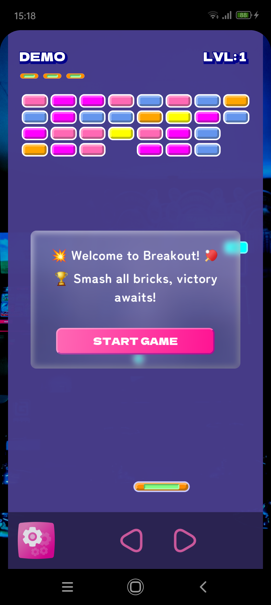
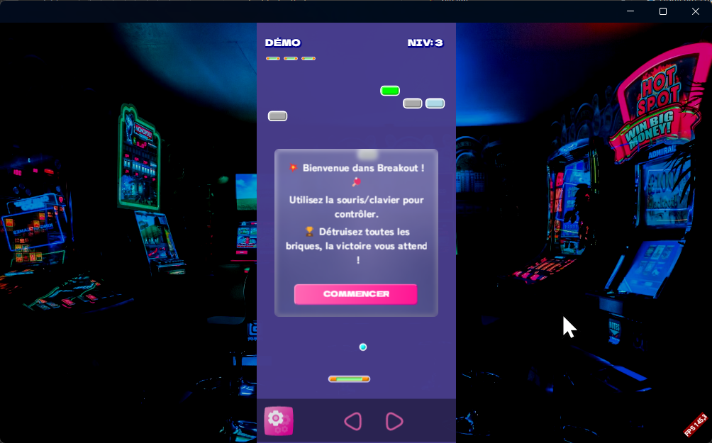
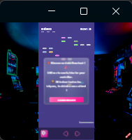
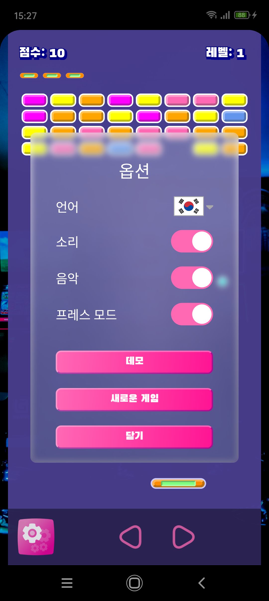
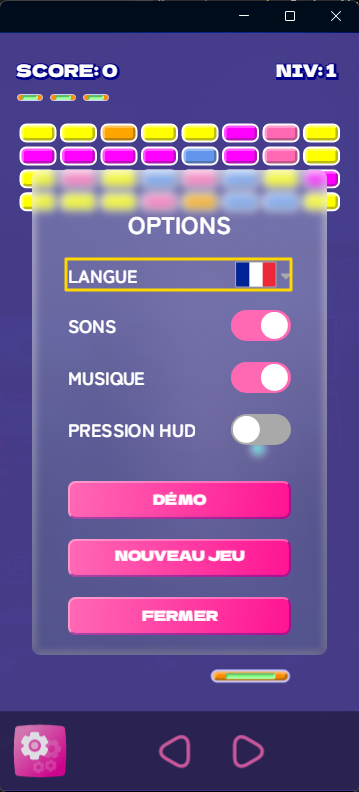

# Building A Cross-Platform Game in .NET MAUI with DrawnUI and Hot Preview

This is my third game etude for .NET MAUI after [SpaceShooter](https://github.com/taublast/Maui.Game.SpaceShooter) and [Doom.Mobile](https://github.com/taublast/Doom.Mobile). We will discuss the creation of the Breakout game in .NET MAUI as well as how this experience could be used for creating other games to be played on platforms .NET MAUI supports: Android, iOS, MacCatalyst, Windows.

> This article has [a second part](https://github.com/BretJohnson/hot-preview) about using [Hot Preview](https://github.com/BretJohnson/hot-preview) by [Bret Johnson](https://github.com/BretJohnson) when designing an app. This technology shrinks tremendously the time we spend, providing with the possibility to instantly preview screens/controls/states of your application.

## Breakout Game Features
* 12 levels of Breakout madness!
* Catch powerups destroying the bricks!
* If you are lucky enough shoot at bricks in Destroyer mode!
* Discover hidden music by catching rare powerups
* Auto-generated levels
* Available in 9 languages: English, German, Spanish, French, Russian, Italian, Japanese, Korean, Chinese
* Play with touch/keyboard/mouse/Apple controllers



*Breakout game's welcome screen on Android phone showcasing the colorful brick layout and modern UI design. AI bot is playing paddle in demo mode. Created with DrawnUI for .NET MAUI.*

## The Challenge: Beyond Traditional MAUI Apps

When working with .NET MAUI we are so used to making business apps that making a game can become a dream to fulfill.  
And preferably still in MAUI to stay in the comfort zone. But what tools to use? Should I place sprites inside a `Grid` and use translation for positioning them?  
If you've already been looking at how to escape from a predefined set of controls to a "draw what you want" concept you might already have tried [SkiaSharp](https://github.com/mono/SkiaSharp). The library that exposes the [Skia](https://skia.org/) cross-platform rendering library to the .NET world and we can draw something new we imagined.

To tell the truth at some point I fail to visualize in my head the end result of all the "draw path, close path, draw surface" etc so to draw on a game canvas it would be great to use something really abstract.
The ideal would be to use a familiar layout system with `LayoutOptions` known by heart, to arrange controls that would draw what I want just by changing bindable properties.

When looking at the game screenshot above you might have wondered "are those SVG or something, or they draw images for bricks"?
Well, not at all:

```csharp
public class BrickSprite : SkiaShape, IWithHitBox, IReusableSprite
{
    public static BrickSprite Create()
    {
        return new BrickSprite
        {
            UseCache = SkiaCacheType.Operations,
            BackgroundColor = Colors.Red,
            CornerRadius = 6,
            WidthRequest = 50,
            HeightRequest = 24,
            StrokeColor = Colors.White,
            StrokeWidth = 2,
            BevelType = BevelType.Bevel,
            Bevel = new SkiaBevel()
            {
                Depth = 4,
                LightColor = Colors.White,
                ShadowColor = Color.Parse("#333333"),
                Opacity = 0.33
            },
            ZIndex = 4
        };
    }
}
```

That's our brick, and it already feels better seeing `WidthRequest` and other familiar properties, this suggests it could maybe even be placed inside a layout with some manual offsets like "TranslationX" or something.
Not only this, it looks like this all is on points and would be scaled to any display size.

### Controls As Sprites

Using the [DrawnUI](https://github.com/taublast/DrawnUi.Maui) NuGet I can place drawn custom controls inside a hardware-accelerated canvas with a familiar WPF-like layout system and draw text, shapes, shadows and other effects by just setting bindable properties, without really caring about how this is all is drawn with Skia.
Inside a MAUI-like layout experience we use intuitive concepts like `SkiaLabel`, `SkiaShape`, `SkiaLayout` and more.

Now every single sprite in the game is basically just a styled control:

```csharp
public class BallSprite : SkiaShape, IWithHitBox, IReusableSprite
{
    public BallSprite()
    {
        UseCache = SkiaCacheType.GPU;
        HeightRequest = 15;
        HorizontalOptions = LayoutOptions.Center;
        VerticalOptions = LayoutOptions.End;
        Type = ShapeType.Circle;
        StrokeColor = Colors.White;
        StrokeWidth = 2;
        LockRatio = 1;
        BackgroundColor = Colors.Aqua;
        SpeedRatio = 1;
        IsActive = true;
        BevelType = BevelType.Bevel;
        Bevel = new SkiaBevel()
        {
            Depth = 4,
            LightColor = Colors.White,
            ShadowColor = Color.Parse("#333333"),
            Opacity = 0.33
        };
    }

    // Ball can transform into a fireball with powerup
    public bool IsFireball { get; set; }

    public void UpdatePosition(float deltaSeconds)
    {
        float moveX = BreakoutGame.BALL_SPEED * SpeedRatio * MathF.Cos(Angle) * deltaSeconds;
        float moveY = BreakoutGame.BALL_SPEED * SpeedRatio * MathF.Sin(Angle) * deltaSeconds;

        Left += moveX;
        Top += moveY;
    }
}
```

Controls can be placed inside layouts similar to vertical stack, horizontal stack, absolute (think MAUI Grid with 1 col/row) etc.
We can apply many types of transforms here and obviously we could move objects with `TranslationX` and `TranslationY`.

So in a usual scenario you could do a simple `Ball.TranslationX = positionOffsetX` to move horizontally.

But in this new etude I was using another custom set of displacement properties `Left` and `Top`.
Why not usual translations: while optimizing for max FPS-performance it felt better to avoid applying a transformation matrix when it wasn't required.  Instead when a control is cached we can use `Left` and `Top` just to offset control's cache, no matrix transforms involved.

## A Drawn App

### MainPage

Usually there is MainPage.xaml and here we have MainPage but that supports .NET HotReload. Instead of using XAML we build the UI in code using the `Build()` method.

The app structure is quite simple:

```csharp
public partial class MainPage : BasePageReloadable
{
    Canvas Canvas;

    // This is called by constructor and .NET HotReload
    public override void Build()
    {
        Canvas?.Dispose();

        Canvas = new Canvas()
        {
            Content = new SkiaLayer()
            {
                Children =
                {
                    //WALLPAPER
                    new SkiaImage(@"Images/back.jpg")
                    {
                        UseCache = SkiaCacheType.Image,
                        AddEffect = SkiaImageEffect.Darken,
                        Darken = 0.2
                    }.Fill(),

                    //MAIN VIEW
                    new SkiaViewSwitcher()
                    {
                        HorizontalOptions = LayoutOptions.Center,
                        WidthRequest = 360,
                        HeightRequest = 760,
                        VerticalOptions = LayoutOptions.Center,
                        Children =
                        {
                            new BreakoutGame(), // Our game goes here
                        }
                    }
                }
            }.Fill()
        };

        this.Content = Canvas;
    }
}
```

The `BasePageReloadable` class inherits from `DrawnUiBasePage` (which is just a `ContentPage` with keyboard support) and automatically calls `Build()` when .NET HotReload triggers:

```csharp
public class BasePageReloadable : DrawnUiBasePage
{
    protected virtual void ReloadUi(Type[] obj)
    {
        MainThread.BeginInvokeOnMainThread(() =>
        {
            CountReloads++;
            Build(); // Rebuild UI when HotReload hits
        });
    }
}
```

This means when you change code and save, the UI rebuilds instantly without recompiling. This allows us to apply changes and hot-reload any code, not just UI-related, without recompiling.

### .NET HotReload

This game wasn't using XAML for UI and .NET HotReload was very useful for reloading the game while changing code logic instead of recompiling everything. XAML HotReload is great, but when it comes to changing the engine logic on the fly it might be better to use code-behind HotReload.
The page we were using was a `BasePageReloadable`, a subclassed `ContentPage` that has it's `Build` method triggered when HotReload hits.  

If you find `HotReload` requiring you to constantly rebuild the app, make you clear `bin/obj` folders: consider temporarily changing project to use just one framework instead of multiple. This comes from how HotReload currently works.

Another "by the way" tip to speed up your compilations with Visual Studio: if it starts to freeze during compilations or "just like that", run `taskkill /F /im msbuild.exe` in terminal. I keep it open at all times.

### Hot Preview: The Game Changer 

To be able to preview drawn content with Hot Preview we wrapped the game inside a `SkiaViewSwitcher` which can hold multiple views and navigate between them on a drawn canvas.

Using Hot Preview changed everything! 🔥
Imagine being able to:
- Preview different game states instantly
- Switch between levels without recompiling
- Test different sprite configurations on the fly
- Preview the game in different languages
- Execute any "preview" action in realtime

The development experience becomes incredibly fluid when you can see your changes instantly instead of navigating through the app or recompiling. I can assure you this has cut the development time for me at minimum in half

### Developing on Windows

I was mainly developing on Windows for faster compilation and more fluent HotReload experience.   
When working with MAUI business apps the workflow is similar: even if the app is not designed to run on Windows it's saves **a lot** of time to be working on it's Windows-Mock version and then adjust for mobile.

### Responsive Scaling Challenge

One big challenge was making the game work on any screen size. You don't know in advance what people will have - large desktop screens, phones, iPads, very small screens. The game needs to scale to all of them.

When rendering DrawnUI uses obviously a rendering scale and we customize the rendering scale so that game uses not the display scale, but a fixed aspect size, so that Breakout game field stays same height/width for all the players, while stretching to fill their screens.

As for the empty spaces left, we would draw a background image behind the game field. Also would be nice to make the game field itself a bit transparent avoiding a plain color background, to have a textured feel due to the background image behind.



The bonus we had that we were backed by shapes instead of bitmaps for sprites, so the game went from TV-size ready to a small smart-watch size friendly game:




The game is designed for a fixed logical aspect size of 360x760 points, then DrawnUI automatically scales everything to fit the actual screen while maintaining aspect ratio. So we needed a custom canvas to handle this scaling:

```csharp
public class RescalingCanvas : Canvas
{
    public float GameScale { get; set; } = 1;

    protected override void Draw(DrawingContext context)
    {
        var wantedHeight = Breakout.Game.BreakoutGame.HEIGHT * context.Scale;
        var wantedWidth = Breakout.Game.BreakoutGame.WIDTH * context.Scale;

        var scaleWidth = this.DrawingRect.Width / wantedWidth;
        var scaleHeight = this.DrawingRect.Height / wantedHeight;

        GameScale = Math.Min(scaleWidth, scaleHeight);

        context.Scale *= GameScale;

        base.Draw(context);
    }
}
```

The canvas handles all the scaling math automatically, so we can focus on game logic instead of dealing with different screen densities and sizes.

## The Game Loop

The game logic is just... a game logic. If you've written games in WPF, WinForms, or any other framework, you'll feel right at home.
We are using a helper from DrawnUI offering a game loop helper so we use

```csharp
public override void GameLoop(float deltaSeconds)
```
to place our frame processing code there. We get the elapsed time after the previous frame is fractional seconds.

Inside we:

* process input
* detect collisions
* remove queued sprites from game field
* add new queued sprites to game field
* change game state

Game loop runs on rendering thread, it can be different from UI-thread upon different platforms. We use `MainThread` to access UI-thread when needed, if we need to access MAUI views or other native API. All our drawn controls do not require that and can be accessed from background thread.

Nuances of game mechanics will be different for each game, you can use the `GameLoop` to fill it with your own game logic.

Using AI LLMs saved me a lot of time creating logic that I am not familiar with: raycast collision detection, auto-generation of levels and alike. I am grateful I live in the time we can create things in minutes that would require researching for days, allowing us to create what we imagine, and I would like to pass this message to the world: 

**Expand your lifetime, use AI**


## Localization: 9 Languages Supported

The game features localization support for 9 languages:   
English, German, Spanish, French, Russian, Italian, Japanese, Korean, and Chinese.   
This was implemented using .NET's standard resource system with `.resx` files.




One challenge here was to change a font for a language which glyphs are not available in the default game font, and to even change defined font size for that special font.

So for example:

```csharp
  CreateButton = (text) => new SkiaButton
  {
      Text = text,
      FontSize = 14 * AppFonts.GameAdjustSize,
      FontFamily = AppFonts.GameAutoselect,
      TextColor = Colors.LimeGreen,
      ...
  },

```

would resolve to "FontGame" or maybe "FontGameKo", the logic [is inside](https://github.com/taublast/DrawnUi.Breakout/blob/main/src/Helpers/AppFonts.cs) `AppFonts` helper.

Other two challenges were to change the language on all threads without recreating the game and to select language using a game controller.

The first one was solved by reopening Settings dialog with a new language and by raising OnPropertyChanged for those game controls that where using fluent bindings, like Score etc.

```csharp
        /// <summary>
        /// Redraw game labels re-open dialog when we change language
        /// </summary>
        public void RedrawFromOptions()
        {
            OnPropertyChanged(nameof(Level));
            OnPropertyChanged(nameof(Score));
            OnPropertyChanged(nameof(State));
            State = PreviousState;
            ShowOptions();
        }

```

A game label like Score uses fluent bindings, that work on any thread, you can see it would redraw changing font, font size, after `RedrawFromOptions` was called:

```csharp
  //SCORE/DEMO
  new SkiaRichLabel()
  {
      FontFamily = AppFonts.GameAutoselect,
      FontSize = 17 * AppFonts.GameAdjustSize,
      ...
  }
  .ObserveProperties(this, [nameof(Score), nameof(State)], me =>
  {
      me.FontFamily = AppFonts.GameAutoselect;
      me.FontSize = 17 * AppFonts.GameAdjustSize;

      if (State == GameState.DemoPlay)
      {
          me.Text = ResStrings.DemoMode.ToUpperInvariant();
      }
      else
      {
          me.Text = $"{ResStrings.Score.ToUpperInvariant()}: {Score:0}";
      }
  }),
```

The second challenge of selecting language using a game controller was solved by using a custom control that detects if it was tapped really with touch (finger/mouse) or the tap was fake from a controller/keyboard and shows either platform native selection list or automatically selects next language.    
`DisplayFlag` is a custom control deriving from `SkiaSvg` that draws an appropriate svg it takes from App resources:

```csharp
  new DisplayFlag()
      {
          Tag="LangFlag",
          HorizontalOptions = LayoutOptions.End,
          VerticalOptions = LayoutOptions.Center,
      }
      .Initialize(me =>
      {
          var lang = AppSettings.Get(AppSettings.Lang, AppSettings.LangDefault);
          me.Lang = lang;
      })
      .OnTapped((me, a) =>
      {
          //is this a real tap?
          if (a.Parameters.Event != null)
          {
              AppLanguage.SelectAndSet();
          }
          else
          {
              //it was controller's tap
              AppLanguage.SelectNextAndSet();
          }
      }),
```

This all makes it so all UI text, from menu buttons to game instructions, adapts dynamically to language change, making the game accessible to international players.

If you would like to see your missing language added, [please contribute](https://github.com/taublast/DrawnUi.Breakout)!

## Input Support

The game supports:

- Touch controls for mobile devices
- Mouse input for desktop platforms
- Keyboard controls  
- External game controllers

We can use keyboard and external game controllers to play absolutely without using touch/mouse.  

When using keyboard or a controller, dialogs show selection rectangles over supported elements and you can totally play without using touch or mouse with just a keyboard or a game controller.



*Option inside dialog selected by keyboard/game controller for playing without touch/mouse*

[Shaun Lawrence](https://github.com/bijington) hugely contributed to testing and enhancing this technology and has provided an Apple game-controller support for you to play with:

<div class="video-container-github">
<video controls muted autoplay playsinline>
  <source src="../../assets/vids/shaunbreakout.mp4" type="video/mp4">
  Your browser does not support the video tag.
</video>
</div>

Using `IInputController` and `IGameKeyHandler` interfaces for this.

```csharp

public class GameControllerInput : IInputController
{
 
    public void ProcessState() // called every frame
    {
        if (_gameController is null)
        {
            return;
        }
        
        if (_gameController.LeftStick.XAxis.Value < -0.001f ||
            _gameController.Dpad.XAxis.Value < -0.001f)
        {
            _game.SendKey(GameKey.Left);
        }
        else if (_gameController.LeftStick.XAxis.Value > 0.001f ||
                 _gameController.Dpad.XAxis.Value > 0.001f)
        {
            _game.SendKey(GameKey.Right);
        }
        else
        {
            _game.SendKey(GameKey.Stop);
        }
        ...
    }

```

In the end we added a new option inside game Settings: by default you move the finger to move the paddle, but if you enable "Press HUD" mode then you can move the paddle by press the left or right side of bottom HUD - all like with keyboard/controller!


## Audio

Sound is crucial for a good game experience. I am using [Plugin.Maui.Audio](https://github.com/jfversluis/Plugin.Maui.Audio) - it's an awesome library that provides all the needed tools, and it uses native platform players. Sadly on Android native players affect smoothness much when playing many sounds. 
So I had to try [SoundFlow](https://github.com/LSXPrime/SoundFlow) for Android and it solved the performance issue completely.

The game has two main types of audio:
- **Game sounds** - ball bouncing, brick breaking, powerup collection
- **Background music** - normal gameplay, speedy mode, special powerups
 
The audio implementation is hidden behind `IAudioService audioService`:

```csharp
#if !ANDROID
            audioService = new AudioMixerService(Plugin.Maui.Audio.AudioManager.Current);
#else
            audioService = new SoundFlowAudioService();
#endif
```

## Performance Optimizations

### Layered Rendering Cache

The most significant optimization is the DrawnUI layered caching system. We can cache any control, or a set of controls, so they just redraw from cache when not "dirty". Along with other cache usage in Breakout all the bricks are inside one cached layer, so it's updates only when some brick changes, and redraws one prepared bitmap while ball is smoothly flying around. This means hundreds of bricks can render as one cached image until one brick changes.

Even more, an interesting type of cache is used for bricks layout, `ImageComposite`: it redraws only the area that changed, reusing the previous prepared cache for all the other unchanged area. So when a brick changes DrawnUI erases its area from cache and redraws only that one brick changed over it. The performance gain is dramatic  😊

```csharp
new SkiaLayout() //layout with bricks
{
    UseCache = SkiaCacheType.ImageComposite, // Critical for performance
    HorizontalOptions = LayoutOptions.Center,
    Margin = new(0,90,0,0),
}.Assign(out BricksContainer) //bricks would be added to container by code referencing "BricksContainer"
```

### Object Pooling

Our enemy is the Garbage Collector! It loves creating lag spikes when reclaiming allocated memory that is no longer used. Impact on animations? Visible!

Our remedy to this is object pooling: instead of constantly creating and destroying sprites at runtime we would just pre-create them and not let GC to claim them at all:

```csharp
private ReusableSpritePool<BrickSprite> BricksPool = new(MAX_BRICKS);

void RemoveBrick(BrickSprite brick)
{
    BricksLeftToBreak -= 1;
    RemoveReusable(brick); // Returns to pool, not garbage collected
}

 var brick = BricksPool.Get(); //do not create one, take one existing that is unused!
```

Under the hood DrawnUI fights GC too: recycles many resources that could change on every frame, from surfaces to paints, disposing them only when the holding object is disposed and still reusing them with changes.

Among other performance goodies DrawnUI comes with custom handlers for accelerated views adapted for smooth display-synced rendering. I was trying to make the ball fly as smoothly as possible on all platform screens and I think I achieved it.

## Observing MAUI App State

The app and the game change their state when the native app is in front or went sleep mode, we stop/resume music and the game loop.

## Advanced Game Features

### Powerup System
The game features 9 different powerup types, each with unique mechanics:

```csharp
public enum PowerupType
{
    None, Destroyer, StickyBall, ExpandPaddle, ShrinkPaddle,
    SlowBall, FastBall, MultiBall, ExtraLife, Fireball
}
```

- **Destroyer**: Enables shooting bullets at bricks
- **MultiBall**: Spawns additional balls for chaos
- **Fireball**: Ball passes through bricks without bouncing
- **StickyBall**: Ball sticks to paddle for precise aiming
- **ExpandPaddle/ShrinkPaddle**: Changes paddle size
- **SlowBall/FastBall**: Adjusts ball speed
- **ExtraLife**: Grants additional lives

Each powerup has visual feedback, sound effects, and timed duration. The system uses probability-based spawning with different drop rates for balanced gameplay.

### State Management and Game Flow
The game implements a robust state machine:

```csharp
public enum GameState
{
    Unset, Ready, Playing, Paused, Ended, LevelComplete, DemoPlay
}
```

State transitions trigger appropriate UI changes, sound effects, and game logic. The demo mode showcases AI-controlled gameplay, while the pause system preserves game state perfectly.

## Technical Achievements

This project demonstrates what's achievable in .NET MAUI using DrawnUI's abstraction layer over SkiaSharp. A lot of low-level SkiaSharp programming was skipped, which allowed me to work on this game in a matter of days. Familiar MAUI-like layout system and bindable properties make complex graphics programming accessible without sacrificing performance.

This Breakout game implementation showcases:

- **Hot Preview integration** for instant development feedback
- **12 levels** with increasing difficulty and varied brick patterns
- **9 powerup types** with unique mechanics and visual effects
- **9 language localizations** with dynamic switching
- **Enhanced sound usage** for realistic fun
- **Multi-platform input support** (touch, keyboard, gamepad)
- **Layered rendering cache** for optimal performance
- **Object pooling** eliminating garbage collection pressure
- **Professional game architecture** with state management
- **Hardware-accelerated rendering** via DrawnUI and SkiaSharp

## Try It Yourself

Run on Windows, Mac, iPhone, Android and have the same fun I'm having playing this game, as well as my kids, they just love it! 😍

The complete [source code](https://github.com/taublast/DrawnUi.Breakout) is available under the MIT licence, grab, reuse, build, publish! 😋

Would love to see what you build with this please keep me posted. All PR's are obviously welcome too! 

What do you think of this article? Of the game? Is it too much emojis? 😁 Would you like to see more articles about this topic? I have so many questions, please let me know!

## Links

* [Breakout Repository](https://github.com/taublast/DrawnUi.Breakout) with  all the code to build and run the game 
* [Hot Preview](https://github.com/BretJohnson/hot-preview) to dynamically preview levels/states/languages/sprites etc
* [Plugin.Maui.Audio](https://github.com/jfversluis/Plugin.Maui.Audio) for sound on all platforms
* [Soundflow](https://github.com/LSXPrime/SoundFlow) for sound on all platforms
* [DrawnUI for .NET MAUI](https://github.com/taublast/DrawnUi) for layout/gestures/fluent/bindings/rendering pipeline
* [SkiaSharp](https://github.com/mono/SkiaSharp) making this all possible

## Commercial Break

As the [creator of DrawnUI](https://github.com/taublast), I'm available for help to:

- **Implement complex UI** - to create custom drawn controls for .NET MAUI
- **Build drawn apps** - or maybe a game? Draw it all on one canvas.
- **Speed up an existing MAUI app** - by replacing large chunks of native UI with a canvas

Whether you need consulting on optimizing an existing app or creating something new I can help you with the custom-drawn approach. 

---

*This Breakout implementation proves that .NET MAUI, combined with DrawnUI, can deliver high-quality gaming experiences. With 12 levels, 9 languages, different input support, and advanced features, it demonstrates that sometimes the best way to explore a framework's capabilities is to push it beyond its intended boundaries.*

---

<style>

.video-container {
  position: relative;
  padding-bottom: 56.25%; /* 16:9 aspect ratio */
  height: 0;
  overflow: hidden;
  max-width: 100%;
  background: #000;
  margin-bottom: 1em;
}

.video-container iframe {
  position: absolute;
  top: 0;
  left: 0;
  width: 100%;
  height: 100%;
}

.video-container-github {
    min-height: 200px;
    background: #000;
    margin-bottom: 1em;
}

.video-container-github video {
  width: 100%;
  height: 100%;
}

</style>

<!-- Place this tag in your head or just before your close body tag. -->
<script async defer src="https://buttons.github.io/buttons.js"></script>

