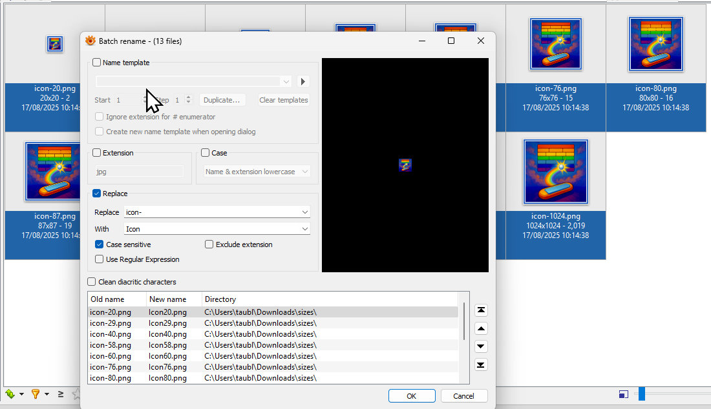

.NET MAUI provides a great way of [creating icons with MauiIcon resources](https://learn.microsoft.com/en-us/dotnet/maui/user-interface/images/app-icons?view=net-maui-9.0), creating rasters for every platform during compilation. There could come a time when you would want to use custom pixel perfect images for an app icon, like native apps do. You would most likely find a trick of embedding raster images into SVG to be used as MauiIcon, though this approach might also have its limitations. 

In this article example we will create native icons for Android and iOS for our existing .NET MAUI (.NET 9) app. Some of you may have read the previous article about [creating a Breakout Game in .NET MAUI](../Breakout/), and now we will publish it to Google Play and AppStore. For that matter we would need a game icon, most games even put their screenshots inside the icon, so we would use an image too.

We will keep the MauiIcon entry as a fallback for all platforms, but override it with platform-specific custom resources for iOS and Android. 

## Android: Creating and Integrating Custom Icons

### Using Android Studio

Our strategy would be to create a simple app, you can just create a blank one and then create icons for it, then copy-paste created resources into our MAUI project.  
Launch Android Studio, I am using Meerkat version here, and create a new empty project, then right-click on `res` folder and add a new Image Asset. 


Select your high-resolution PNG (ideally 1024x1024 or higher) and configure adaptive icons. I played with Resize so that my icon is nicely wrapped for all rounded cases and have set a custom background color.


Generate the icon set and you will see that we now have lots of different size icons in a WEBP format.


### Integrating into MAUI

Now still inside Android Studio right-click on `res` folder and choose `Open In` -> `Explorer`.

 We now need to copy-paste the following into our `Platforms\Android\Resources` MAUI app folder:

```
app\src\main\res\
├── mipmap-anydpi-v26\
│   ├── *.*
├── mipmap-hdpi\
│   ├── *.*
├── mipmap-mdpi\
│   ├── *.*
├── mipmap-xhdpi\
│   ├── *.*
├── mipmap-xxhdpi\
│   ├── *.*
└── mipmap-xxxhdpi\
│   ├── *.*
└── values\
│   ├── ic_launcher_background.xml
```

Then we need to use the native icon instead of the generated MauiIcon, open `AndroidManifest.xml` as source code and replace `appicon` with `ic_launcher`:

```xml
<?xml version="1.0" encoding="utf-8"?>
<manifest xmlns:android="http://schemas.android.com/apk/res/android" android:versionName="1.00" android:versionCode="100101">
	<application android:allowBackup="true" android:icon="@mipmap/ic_launcher" android:roundIcon="@mipmap/ic_launcher_round" android:supportsRtl="true"></application>

</manifest>
```

The `ic_launcher.xml` and `ic_launcher_round.xml` files define adaptive icons that work with Android 8.0+ launcher theming.

Now if you try to compile the app you would get a nice `"resource mipmap/ic_launcher_foreground (aka com.appomobi.drawnui.breakout:mipmap/ic_launcher_foreground) not found.` so we will add the following inside our `csproj` file:

```xml
<!-- Custom Android icons: include webp resources-->
<ItemGroup Condition="$(TargetFramework.Contains('android'))">
  <AndroidResource Include="Platforms\Android\Resources\*\*.webp" />
</ItemGroup>
```

This ensures all your custom Android icons are properly included during compilation and we now have a nice custom icon for Android! 🥳

## iOS: Creating and Integrating Custom Icons

### Structure of iOS App Icon Sets

For iOS the creation of icons consists in creating just different sizes of the same original image. There are many free tools out there, you could use [IconSlayer](https://www.gieson.com/Library/projects/utilities/icon_slayer/). There put your sizes:

```
20, 29, 40, 58, 60, 76, 80, 87, 120, 152, 167, 180, 1024
```
 inside Custom Sizes field and check it, then drop the original image and it will generate all the sizes for you. After clicking `Export` you get a zip file with all the icons. They will be named like `icon-20.png` but we need a different name and without the `-`, so we will use [XnView MP](https://www.xnview.com/en/) to batch rename them: select all and right-click to Rename replacing all `icon-` with `Icon`.



### Integrating into MAUI

Now we need to place these files into our MAUI project inside `Platforms\iOS\Assets.xcassets\icon.appiconset`, create these folders if missing.

Add the following [file `Contents.json`](https://github.com/taublast/DrawnUi.Breakout/blob/main/src/Platforms/iOS/Assets.xcassets/icon.appiconset/Contents.json) too along with your images, this file defines the icon set metadata. 

Now let's tell the app to use this icon set, open `Platforms\iOS\Info.plist` and add our icon set:

```xml
  <key>XSAppIconAssets</key>
  <string>Assets.xcassets/icon.appiconset</string>
```

If there is an existing `XSAppIconAssets` entry there replace it the the one above.

Edit `csproj` file to add:

```xml
<!--Custom iOS icons-->
<ItemGroup Condition="$(TargetFramework.Contains('ios')) == true">
  <BundleResource Include="Platforms\iOS\Assets.xcassets\*\*" />
</ItemGroup>
```

and now we have a nice custom icon for iOS too! 🥳  

## Testing Your Icons

When changing app icons, always perform a clean rebuild:

1. **Clean the solution**: This removes cached build artifacts
2. **Delete bin/obj folders**: Sometimes cached resources persist
3. **Rebuild completely**: Don't just build - rebuild from scratch
4. **Restart physical device/simulator** as it may cache the previous icon
 
## Professional Results

Whether you're building a game with complex 3D-rendered icons or a professional app with a pixel-perfect design this approach delivers professional-quality app icons that match your brand vision. You can get maximum control over the visual elements to make your app icons stand out in competition. 

In case you would want to see a published working example of .NET MAUI app with such native icons please check out the [Breakout repo](https://github.com/taublast/DrawnUi.Breakout).

<style>

.video-container {
  position: relative;
  padding-bottom: 56.25%; /* 16:9 aspect ratio */
  height: 0;
  overflow: hidden;
  max-width: 100%;
  background: #000;
  margin-bottom: 1em;
}

.video-container iframe {
  position: absolute;
  top: 0;
  left: 0;
  width: 100%;
  height: 100%;
}

.video-container-github {
    min-height: 200px;
    background: #000;
    margin-bottom: 1em;
}

.video-container-github video {
  width: 100%;
  height: 100%;
}

</style>

<!-- Place this tag in your head or just before your close body tag. -->
<script async defer src="https://buttons.github.io/buttons.js"></script>

