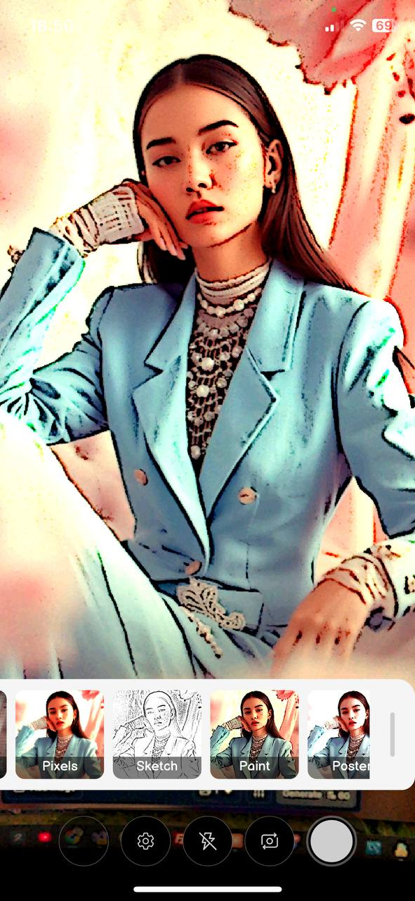
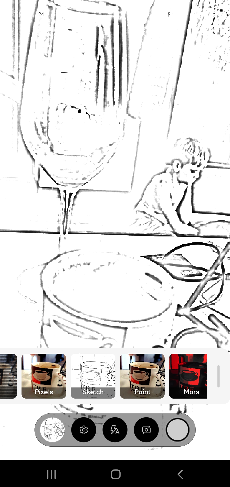
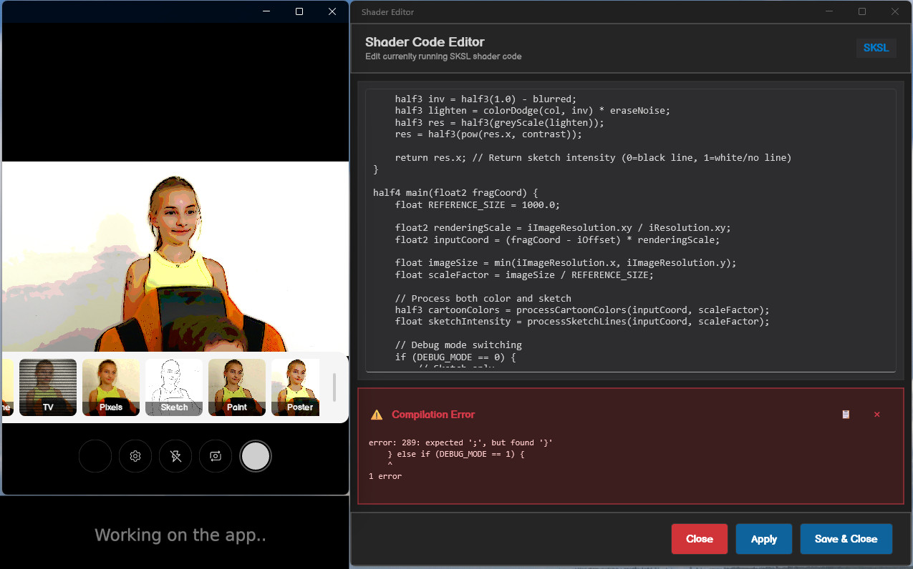
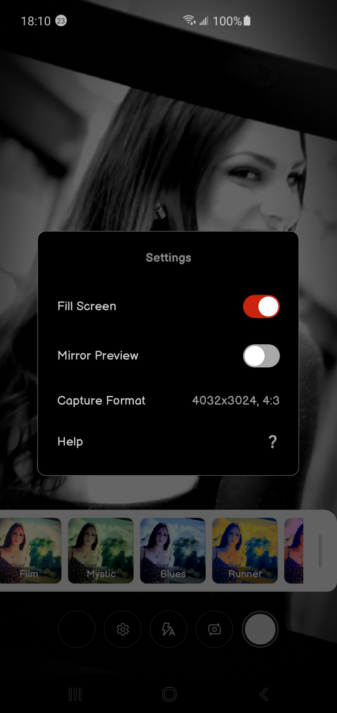
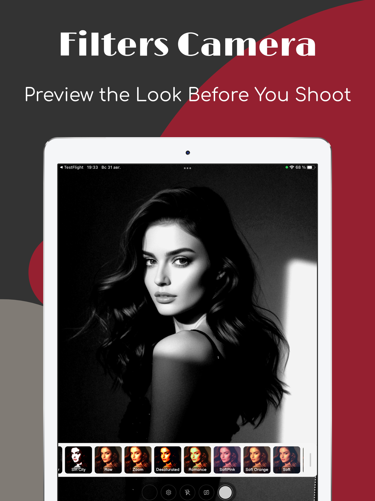

# Real-Time Camera Filters with Hardware-Accelerated Shaders in .NET MAUI

## Meet SkiaCamera: A Drawn Control for .NET MAUI

If you've been following my previous articles you might recall that a `SkiaCamera` control was already used for an [Android ML photo recognition app](../MauiJuly/). Today I'm happy to announce that this control now supports Android, iOS, Mac Catalyst and Windows. You could use it inside a classic .NET MAUI app by wrapping it into a [DrawnUI Canvas](https://drawnui.net/).

[SkiaCamera](https://github.com/taublast/DrawnUi/tree/main/src/Maui/Addons/DrawnUi.Maui.Camera) provides camera preview that seamlessly integrates with DrawnUI's hardware-accelerated visual effects system, allowing you to do whatever you please with live camera feed and to process still captured photos with all the power of [SkiaSharp](https://github.com/mono/SkiaSharp).



It looks perfect for any camera data processing, from sending cropped thumbnails to ML/AI to displaying previews in any imaginable way, including any drawn UI around. We will use it for creating that nice combination of Skia SKSL shaders with camera feed.

Along with the app we will discuss you could also see another `SkiaCamera` usage example inside the [DrawnUI Demo app](https://github.com/taublast/DrawnUi.Maui.Demo).

## Use-Case: Real-Time Camera Effects

### Why a Drawn App?

Since I had a lot of fun [playing with SKSL shaders previously](https://github.com/taublast/ShadersCarousel) I definitely had to try them with the drawn camera feed! Would it lag? Can Skia render a fluid video flow with shaders applied?

SkiaSharp running with hardware acceleration did indeed provide smooth rendering, performance was tested first on Debug with mid-range Android phones. And even on low-range devices the FPS is fine in Release builds.

I have created a cross-platform app to make this technology available for an easy demonstration. You could install `Filters Camera` from [AppStore](https://apps.apple.com/us/app/filters-camera/id6749823005) and [GooglePlay](https://play.google.com/store/apps/details?id=com.appomobi.drawnui.shaderscam) as we would further discuss the development process behind it. The app also runs on Windows and on Mac, but you would need to compile it yourself. Link to complete source code is [at the end](#source-code) of this article.

### Camera Display

Basically camera control contains a customizable `SkiaImage` that displays the current camera frame. It is accessed via `Display` property. This image could be scaled to Fit or Fill the viewport, or transformed, for example, to flip horizontally as you see in a lot of Mirror apps. The control receives image data from native code and sets as source to `Display`. The whole rendered by the usual DrawnUI pipeline with layout, transforms and effects.

In this app we have subclassed `SkiaCamera`, to create a `CameraWithEffects` that simply auto-adds shader effect to `Display`. 

````csharp

  // create a specific shader processing visual effect
  _shader = new ClippedShaderEffect(Display)
  {
      ShaderSource = shader.Filename,
  };

//apply to self
if (_shader != null && !VisualEffects.Contains(_shader))
  {
      VisualEffects.Add(_shader); //that's it, the rendering pipeline 
      // will apply the shader to camera control display 
  }
````

What is `ClippedShaderEffect`? A subclassed "standart" `SkiaShaderEffect` with some additional clipping applied. When playing with Fit and Fill modes I realized we needed to clip the rendering area of the camera display it to the actual image area to avoid applying shader to black borders that appear in case of Fit. `SkiaImage` provides us with `DisplayRect` property that returns the real rect taken by the scaled image source on the canvas. While the whole image control would take its `DrawingRect` area with borders included.

````csharp
public class ClippedShaderEffect : SkiaShaderEffect
{
    // _image is a reference to camera Display property 
    // that holds the current frame unprocessed preview image
    public override void Render(DrawingContext ctx)
    {
        if (_image != null)
        {
            var clipped = ctx.Destination;
            clipped.Intersect(new ((int)Math.Round(_image.DisplayRect.Left),
                (int)Math.Round(_image.DisplayRect.Top),
                (int)Math.Round(_image.DisplayRect.Right),
                (int)Math.Round(_image.DisplayRect.Bottom)));
            base.Render(ctx.WithDestination(clipped));
        }
    }
}
````

### Captured Photo

Previewing is one thing, but we also need to save processed full-size captured still photo with same effects applied!

The trick is to use `RenderCapturedPhotoAsync` helper method provided by SkiaCamera. It runs the passed as `Action` logic on the rendering thread this allows us to use GPU acceleration even for "offscreen" rendering.


````csharp
  var finalImage = await Camera.RenderCapturedPhotoAsync(captured, null, image =>
  {
      if (SelectedShader != null)
      {
          var shaderEffect = new SkiaShaderEffect()
          {
              ShaderSource = SelectedShader.Filename
          };
          image.VisualEffects.Add(shaderEffect);
      }
  }, true); //true to use GPU acceleration

  ...
````
We are also injecting custom EXIF data to indicate camera model and name as our app name.

````csharp
    captured.Image = finalImage;
    captured.Meta.Vendor = "DrawnUI";
    captured.Meta.Model = "Shaders Camera";
    //SkiaCamera helper method does all the magic for us
    await Camera.SaveToGalleryAsync(captured, false); 
````

For future works I'm thinking to add the selected filter name into some of the additional fields. There is a lot of possible improvements to be made, current state is a starting point: please feel free to contribute!

## SKSL Shaders

### What is SKSL?

[SKSL (Skia Shading Language)](https://skia.org/docs/user/sksl/) is a close cousin to GLSL. GLSL shaders can be easily ported to SKSL, especially with the help of LLMs. I follow the concept of using standard uniforms you would see as Shader Inputs at [https://shaders.skia.org](https://shaders.skia.org/) almost same are used at [https://www.shadertoy.com](https://www.shadertoy.com/).

I have created all of the shaders used in the app with the help of LLMs. Interestingly Claude Sonnet 4 was able to really replicate the specifics of several well known black and white films, what was confirmed by professional photographers. I didn't put exact film names into effects titles though not to overwhelm an average user.

Some complex shaders required several days of work and tuning, like
those that create "drawn" effects.



If you dig inside included shaders code you would see a base for combining reusable functions across different shaders. For example few of them apply a zoom lens effect: in theory our app could apply them to every shader, we could let users select a lens to be applied on top of any of color effects. 

An important challenge for our case was to make shaders provide same visual result on small preview and large scale captured images. Best demonstrated with Sketch where when the image size grows more smaller lines could appear making the captured image totally different from preview, problem solved!

### Desktop SKSL Editor

The question arose very rapidly on how to develop shaders for the app, to be able to make small tuning changes and instantly see the result, without recompiling the app while shaders are shipped as files.

We have this wonderful MAUI feature for desktop as to open new app pages in stand-alone windows and this has brought the SKSL Editor to life: on desktop you need to long-press the shader preview in the drawer menu to make the editor appear in a new window.



*Working inside shader editor on Windows PC and a webcam with my daughter helping me much.*

The editor allows you to edit and to apply the code to the running camera preview, so that you can see the result in real-time. It would also show you compilation errors so you can copy and paste them to LLM if unsure about how to fix.

Of course to reuse the final code you would need to paste it to the embedded file within the `Raw` folder. If we were developing a dedicated editor app, we could go with exporting all shaders to app cache folder once and then editor would modify them at run-time. Another limitation of the current quick implementation is that the app wouldn't use the edited code for saving the photo, only for the live preview: enough for our development needs.
  
## The Development Experience

Initially all the UI was created in XAML making use of .NET MAUI XAML HotReload, and the developing workflow was very smooth. Just before publishing I was playing with speed optimizations and ended up re-creating the main page in code-behind with fluent extensions looking for a faster app startup.

So the source code actually has both XAML and code-behind versions of the main page with camera, could be quite interesting and maybe useful for some developers to compare.



I used MAUI popups for Settings and the Help screen. For that matter I went with the [FastPopups](https://github.com/taublast/FastPopups) library created not so long ago. The reason for this was to be confident with the popup full-screen behaviour on all platforms, as well as the HotReload support.

## Final Thoughts

SkiaSharp strikes again with some impressive features it provides. Our app demonstrated that .NET MAUI, combined with SkiaSharp, can deliver quality applications with complex rendering.

This experiment ended up showing incredible opportunities shaders provide to data processing. I'm saying data and not image, because we could work with any data using shaders GPU-accelerated processing. Already existing complex data/image processing C# code could be replaced with SKSL hardware-accelerated shaders all around the .NET ecosystem. Thanks to SkiaSharp v3. 

The current codebase opens visible possibilities for creating GPU-accelerated image and video editors, on desktop and mobile, with .NET MAUI. Video recording is the next step on the `SkiaCamera` roadmap.

I hope this article and its codebase would inspire you to use the drawn approach in creating NET MAUI apps and maybe help create another canvas-drawn camera app of your own!

## Source Code

The complete [source code](https://github.com/taublast/ShadersCamera) is released under MIT license, you can clone, build, and start experimenting. It includes all the SKSL shaders and the desktop editor.

Please feel free to contribute your own shaders and any improvements! 

## Links and Resources

* [ShadersCamera Repository](https://github.com/taublast/ShadersCamera) - Complete source code and setup instructions

{: .left width="300"}

* [SkiaCamera Control](https://github.com/taublast/DrawnUi/tree/main/src/Maui/Addons/DrawnUi.Maui.Camera) - The camera preview control used in the app
* [DrawnUI Demo](https://github.com/taublast/DrawnUi.Maui.Demo) - Another example of using SkiaCamera
* [DrawnUI for .NET MAUI](https://github.com/taublast/DrawnUi) - The rendering engine powering the camera effects
* [FastPopups for .NET MAUI](https://github.com/taublast/FastPopups) - High-performance popup library
* [SKSL Documentation](https://skia.org/docs/user/sksl/) - Official Skia Shading Language reference
* [SkiaSharp](https://github.com/mono/SkiaSharp) - The foundation that makes it all possible

---

 *The author is available for consulting on drawn applications and custom controls for .NET MAUI. If you need help creating custom UI experiences, optimizing performance, or building entirely drawn apps, feel free to reach out.*

<style>

.left {
    margin: 0.75rem 2.2rem 1rem 0;
    float: left;
}

/* Responsive behavior for mobile */
@media (max-width: 576px) {
    .left {
        float: none;
        margin: 0.75rem auto 1rem auto;
        display: block;
    }
}

.video-container {
  position: relative;
  padding-bottom: 56.25%; /* 16:9 aspect ratio */
  height: 0;
  overflow: hidden;
  max-width: 100%;
  background: #000;
  margin-bottom: 1em;
}

.video-container iframe {
  position: absolute;
  top: 0;
  left: 0;
  width: 100%;
  height: 100%;
}

.video-container-github {
    min-height: 200px;
    background: #000;
    margin-bottom: 1em;
}

.video-container-github video {
  width: 100%;
  height: 100%;
}

</style>

<!-- Place this tag in your head or just before your close body tag. -->
<script async defer src="https://buttons.github.io/buttons.js"></script>

