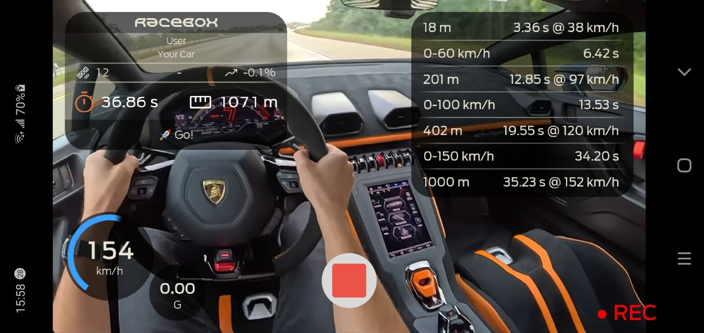

# AI Captions and Live Video Processing in .NET MAUI

## Intro

We have several solid ways of  recording video in .NET MAUI today, like [CommunityToolkit.Maui.Camera](https://learn.microsoft.com/en-us/dotnet/communitytoolkit/maui/views/camera-view), MAUI [MediaPicker](https://learn.microsoft.com/en-us/dotnet/maui/platform-integration/device-media/picker) and more.
For non-standard cases as heavy branding, filters, HUDs, audio and video real-time processing or  getting feed for AI/ML [`SkiaCamera`](https://github.com/taublast/DrawnUi/tree/main/src/Maui/Addons/DrawnUi.Maui.Camera) comes to help. Best for:  

- Audio live processing
- Live preview processing effects, sending to AI/ML etc
- Captured hi-res photo post-processing
- Processing video in real-time before encoding



*Production: Racebox .NET MAUI Android app recording video with HUD encoded in real-time.*

Provides useful hardware-level options like video stabilization, audio mode (raw, voice etc) and more, **SkiaCamera** is open source MIT software and supports **iOS, MacCatalyst, Android, and Windows**.

>On "why another camera library": this one is powered by **SkiaSharp**. Started from a case of real-time photo filters that were applied to native camera preview and saved photos using **RenderScript** on Android and **Metal** shaders on iOS. When SkiaSharp introduced hardware acceleration for Windows it became totally worth to port this all to use SkiaSharp SKSL shaders. SkiaSharp demonstrated so much freedom to process and draw the camera feed, that video and audio capture and processing was confidently added on top .

There is actually a large [README](https://github.com/taublast/DrawnUi/tree/main/src/Maui/Addons/DrawnUi.Maui.Camera) in the repo, also the [previous article](https://taublast.github.io/posts/SolTempo/) was already about SkiaCamera audio processing and  today we will focus on video recording. The provided sample app also handles still photo capture. [The sample](https://github.com/taublast/DrawnUi/tree/main/src/Maui/Samples/Camera) that comes with the repo is a powerful playground with almost all the camera settings, live audio visualizers, OpenAi powered captions encoded over the final video, SKSL video filters and much more.

<!-- TODO: add hero video showing the sample app recording with EQ + live captions overlay -->

<!-- TODO: screeshots or video -->

## Control Setup

To use `SkiaCamera` control inside a **.NET MAUI** app we need to install the package, initialize, and drop the camera into a hardware-accelerated **SkiaSharp** canvas.

### Install:

```bash
dotnet add package DrawnUi.Maui.Camera
```

### Initialize 

Inside `MauiProgram.cs`:

```csharp
builder.UseDrawnUi();
```

### UI 

Place control inside the canvas, for example:

```xml
xmlns:draw="http://schemas.appomobi.com/drawnUi/2023/draw"
xmlns:camera="clr-namespace:DrawnUi.Camera;assembly=DrawnUi.Maui.Camera"

<Grid VerticalOptions="Fill" HorizontalOptions="Fill">
	<draw:Canvas
		HorizontalOptions="Fill"
		VerticalOptions="Fill"
		RenderingMode="Accelerated"
		Gestures="Lock">

		<camera:SkiaCamera
			x:Name="Camera"
			HorizontalOptions="Fill"
			VerticalOptions="Fill"
			BackgroundColor="Black"
			CaptureMode="Video" />

	</draw:Canvas>
</Grid>
```

Important:
* Keep the container stable: no `Auto` rows, no missing `Fill`, no missing width or height requests.
* For correct saved feed orientation lock the app or the camera page to portrait. That does not mean we cannot respond to landscape rotation in the UI, and we do exactly that in this article's example.


### Permissions

Setup permissions per platform as described in the [README](https://github.com/taublast/DrawnUi/tree/main/src/Maui/Addons/DrawnUi.Maui.Camera). Then optionally define permission flags for your specific control so it can automatically check and request them:

```csharp
Camera.NeedPermissionsSet = NeedPermissions.Camera
    | NeedPermissions.Gallery
    | NeedPermissions.Microphone;
```

### Power On/Off

The camera power is controlled by a static bindable `IsOn` property. Turn it on when we need it, for example right after the canvas appears:

```csharp
// could attach this event handler in XAML too
Canvas.WillFirstTimeDraw += (sender, context) =>
{
	if (CameraControl != null)
	{
		Tasks.StartDelayed(TimeSpan.FromMilliseconds(500), () =>
		{
			CameraControl.IsOn = true;
		});
	}
};
```

In case you have a dedicated camera page an obvious hook would be the one when your camera page did appeared: the exact code would depend on your app navigation implementation.

Camera will automatically turn off without changing `IsOn` when the app goes to background, and will restore its power state when app resumes, no additional coding is needed for this. 

## Sample App

Now that we have our camera up and running, let's see what it can do.

Sample uses only code-behind, another `SkiaCamera` usage example uses XAML: [DrawnUI For .NET MAUI Demo](https://github.com/taublast/DrawnUi.Maui.Demo)

App UI has 3 main parts: 

* Top header allows fast switch between Photo an Video modes, and AI captions control.
* A middle overlay quick camera control buttons also presents a captured feed tappable thumbnail
* Bottom drawer provides large camera settings organized into three sections: `Input`, `Processing`, and `Output`.

`Input` is where the sample switches between photo and video mode, picks the active camera, picks the audio device, and chooses the current capture format. `Processing` is where the fun starts: toggle real-time processing, turn audio monitoring on, switch visualizers, boost gain, and enable speech recognition. `Output` decides what the app actually saves: audio on or off, video on or off, audio codec, pre-recording, pre-record duration, and geotagging.

That layout is useful because it makes the whole recording pipeline visible in one place. We are not just looking at a camera preview. We are looking at input settings, live processing, and final recording output all wired together.

For this article the route is simple: keep real-time processing on, feed live audio into the overlay and speech pipeline, and record the composed result directly into the saved video.


In the sample app, we subclassed `SkiaCamera` into an `AppCamera` for convenience and enabled the processed recording path by default:

```csharp
public partial class AppCamera : SkiaCamera
{
	public AppCamera()
	{
		NeedPermissionsSet = NeedPermissions.Camera | NeedPermissions.Gallery | NeedPermissions.Microphone;
		InjectGpsLocation = true;

		UseRealtimeVideoProcessing = true;
		VideoQuality = VideoQuality.Standard;
		EnableAudioRecording = true;

		FrameProcessor = OnFrameProcessing;
		PreviewProcessor = OnFrameProcessing;
	}
}
```

That single choice changes the role of the control. Preview and recording now go through the same drawn overlay path. If your overlay is rendered during `FrameProcessor`, it is not a temporary UI decoration anymore — it becomes part of the encoded media. Recording becomes composition, not just capture.

### UI Orientation

Camera apps usually lock their UI in portrait orientation, then respond to device rotation by rotating icons and controls. `SkiaCamera` was designed in that spirit and expects you to lock the container page or the whole app in portrait, while DrawnUI still provides device orientation info in degrees and enums so the UI can react at runtime.

There are native ways to lock a specific page orientation, but in this sample we locked the whole app:

**Android:**

Inside `MainActivity.cs`, edit the decoration attribute for a limited `ScreenOrientation`:

```csharp
[Activity(Theme = "@style/Maui.SplashTheme",
    ScreenOrientation = ScreenOrientation.SensorPortrait,
	...
```

**iOS:**

Edit `Info.plist`:

AppStore requires apps to support landscape for iPad unless we set `UIRequiresFullScreen` too:

```xml
<key>UIRequiresFullScreen</key>
<true/>
<key>UISupportedInterfaceOrientations</key>
<array>
	<string>UIInterfaceOrientationPortrait</string>
</array>
<key>UISupportedInterfaceOrientations~ipad</key>
<array>
	<string>UIInterfaceOrientationPortrait</string>
	<string>UIInterfaceOrientationPortraitUpsideDown</string>
</array>
```

Saved photo and video output will respect the device orientation used when capturing and will be presented correctly in galleries and viewers. Sometimes the frames are stored unrotated and the file metadata carries the orientation used by the viewer.

For the app UI we mimicked the standard Android camera behavior and rotate quick-access icons when the device rotates:

<!-- TODO: add video showing icon rotation and portrait-locked camera UI -->

This is easily done by subscribing to a DrawnUI event:

```csharp
Super.RotationChanged += OnRotationChanged;
```

And then applying inverse rotation to icons.

## A drawn overlay with real structure

You can of course draw directly with `SKCanvas.DrawText`, `DrawRect`, and other SkiaSharp primitives. Sometimes that is the right thing to do.

In the sample app I wanted something richer and easier to iterate on, so the overlay is built as a DrawnUI layout and then rendered onto frames.

The `MainPage` creates a `CameraDataOverlay` and attaches it like this:

```csharp
_previewFrameOverlay = new CameraDataOverlay();
CameraControl.InitializeOverlayLayouts(_previewFrameOverlay);
```

Passing a single layout here means “reuse this overlay for both preview and recording”. If you need different measured trees for preview and recording, `InitializeOverlayLayouts` also accepts a separate recording layout instance.

Inside the overlay, the interesting bit is the double-buffered wrapper:

```csharp
new SkiaLayer()
{
	VerticalOptions = LayoutOptions.Fill,
	HorizontalOptions = LayoutOptions.Fill,
	UseCache = SkiaCacheType.ImageDoubleBuffered,
	Children =
	{
		// visualizer panel + captions panel
	}
}
```

This matters because the encoder thread wants a fast snapshot of the overlay without stalling on layout work every frame. The overlay still feels like regular DrawnUI composition, but the caching strategy is chosen for a recording pipeline.

That overlay contains two visible modules:

- an audio visualizer panel in the top-right corner
- a captions panel near the bottom rendered with `SkiaRichLabel`

So we get a proper layout tree that can still be rendered onto live frames.

<!-- TODO: add screenshot of CameraTests overlay with EQ panel + captions panel visible -->

## Feeding the overlay with live audio

The sample app also uses the camera’s live audio path. In `AppCamera`, `OnAudioSampleAvailable` is overridden so audio can be modified and then forwarded to the overlay visualizers:

```csharp
protected override AudioSample OnAudioSampleAvailable(AudioSample sample)
{
	if (UseGain && sample.Data != null && sample.Data.Length > 1)
	{
		AmplifyPcm16(sample.Data, GainFactor);
	}

	OnAudioSample?.Invoke(sample);

	if (OverlayPreview is IAppOverlay appOverlay)
	{
		appOverlay.AddAudioSample(sample);
	}

	if (OverlayRecording is IAppOverlay appOverlayRecording)
	{
		appOverlayRecording.AddAudioSample(sample);
	}

	return base.OnAudioSampleAvailable(sample);
}
```

Two details matter in this flow:

- the PCM gain is applied in place, with no extra allocation
- the same processed audio sample can drive both visual feedback and the encoder path

So the visualizer is not some fake animation layered on top of the UI. It is reacting to the same audio stream that is being monitored and, if enabled, recorded.

The sample can cycle between several visualizers such as peak monitor, VU meter, oscillograph, sound bars, waveform bars, and a radial gauge.

## Captions from the camera audio

The same audio stream is also used for real-time speech transcription.

`MainPage` subscribes to `AudioSampleAvailable` and feeds the transcription service with the raw PCM stream:

```csharp
private void OnAudioCaptured(byte[] data, int rate, int bits, int channels)
{
	if (_realtimeTranscriptionService != null && IsSpeechEnabled)
	{
		if (rate != _lastAudioRate || bits != _lastAudioBits || channels != _lastAudioChannels)
		{
			_lastAudioRate = rate;
			_lastAudioBits = bits;
			_lastAudioChannels = channels;
			_realtimeTranscriptionService.SetAudioFormat(rate, bits, channels);
		}

		_realtimeTranscriptionService.FeedAudio(data);
	}
}
```

The implementation in this sample uses a WebSocket connection to the OpenAI Realtime transcription endpoint and runs incoming audio through `AudioSampleConverter` first, which handles resampling to 24 kHz and silence gating.

On top of that, a `RealtimeCaptionsEngine` maintains a rolling window of caption lines:

- partial deltas are appended quickly
- committed phrases become finalized lines
- older lines expire automatically after a short timeout

Those lines are pushed back into the overlay panel. Since the same overlay can be reused for recording frames, the captions can stay visible live and also be burned into the final video.

That is the useful distinction:

- feed audio to AI for live transcription
- render the resulting text inside the frame overlay
- get captions in preview and in the encoded file with no second export pass

<!-- TODO: add video showing live speech captions over preview and the saved file -->

## Wrapping existing renderers into DrawnUI

One thing I like in this sample is that the visualizer code itself is not forced to become a “UI control first” design.

The visualizer implementations are just renderers that know how to draw onto SkiaSharp:

```csharp
public void Render(SKCanvas canvas, SKRect destination, float scale)
```

Then `AudioVisualizer : SkiaLayout` wraps that into the DrawnUI layout system:

```csharp
protected override void Paint(DrawingContext ctx)
{
	base.Paint(ctx);

	if (Visualizer != null)
	{
		Visualizer.Render(ctx.Context.Canvas, DrawingRect, ctx.Scale);
	}
}
```

This is a very practical pattern.

You keep a renderer that can still work as plain SkiaSharp drawing code, but you gain layout, alignment, sizing, transforms, caching, and hot reload friendliness by hosting it inside DrawnUI.

That same approach works for other rendering systems too. If you have existing drawing code, you do not need to throw it away to use it inside the camera overlay pipeline.

## Start and stop recording

The actual recording flow stays straightforward:

```csharp
if (CameraControl.IsRecording)
{
	await CameraControl.StopVideoRecording();
}
else
{
	await CameraControl.StartVideoRecording();
}
```

On success, it moves the final result to the gallery:

```csharp
private async void OnVideoRecordingSuccess(object sender, CapturedVideo capturedVideo)
{
	var publicPath = await CameraControl.MoveVideoToGalleryAsync(capturedVideo, MauiProgram.Album);
	_lastSavedVideoPath = publicPath;
}
```

There is also an abort flow:

```csharp
await CameraControl.StopVideoRecording(true);
```

which discards the recording instead of finalizing it.

## Audio-only recording is part of the same control

Video is the headliner in this article, but we can switch the same control into audio-only recording too.

The switch is simple:

- `EnableVideoRecording = false`
- `EnableAudioRecording = true`

So if the app only needs voice notes, spoken annotations, or some other audio-first workflow, you do not have to introduce a second media component just to get there.

And the same `OnAudioSampleAvailable(AudioSample sample)` hook is still the right place if you want deterministic preprocessing such as gain, downmixing, or gating before the encoder sees the samples.

## Pre-recording: capture a few seconds before the event

One of the nicest tricks in the sample app is pre-recording, also known as look-back recording.

Enable it like this:

```csharp
CameraControl.EnablePreRecording = true;
CameraControl.PreRecordDuration = TimeSpan.FromSeconds(5);
```

In this mode the camera keeps a short in-memory circular buffer before the live recording begins. Press record once and it starts pre-recording. Press again and the live recording begins, with the saved file opening on the last few seconds that happened just before that moment. It is a very handy fit for logic-triggered recordings, where the clip should show the seconds leading into the event that triggered it.

The sample UI exposes quick duration options of 2, 5, 10, and 15 seconds. For the full breakdown see the dedicated [PreRecording.md](https://github.com/taublast/DrawnUi/tree/main/src/Maui/Addons/DrawnUi.Maui.Camera/PreRecording.md) document.

## GPS and metadata injection

The sample camera subclass also enables GPS metadata by default:

```csharp
InjectGpsLocation = true;
```

and refreshes location when the camera turns on:

```csharp
if (CameraControl.InjectGpsLocation)
{
	_ = CameraControl.RefreshGpsLocation();
}
```

This way not only `SkiaCamera` will inject location metadata into a captured photo, but into a video MP4 as well, which will show in all apps supporting this, like iOS or Android built-in gallery.

## Final thoughts

If your app needs branded recording, AI-assisted media, sports telemetry, guided capture, captions, or audio-reactive overlays, this control is aimed straight at that kind of problem. 

I hope that `SkiaCamera` will help you create great things. PRs are always welcome!

## Links and resources

- [SkiaCamera / DrawnUi.Maui.Camera](https://github.com/taublast/DrawnUi/tree/main/src/Maui/Addons/DrawnUi.Maui.Camera) - control repository and documentation
- [CameraTests sample app](https://github.com/taublast/DrawnUi/tree/main/src/Maui/Samples/Camera) - sample app used in this article
- [Pre-recording documentation](https://github.com/taublast/DrawnUi/tree/main/src/Maui/Addons/DrawnUi.Maui.Camera/PreRecording.md) - implementation and usage details
- [Racebox](https://github.com/taublast/Racebox) - commercial app that pushed the recorded-overlay workflow
- [Previous article: Real-Time Camera Filters with Hardware-Accelerated Shaders in .NET MAUI](../FiltersCamera/) - earlier post focused on preview/photo processing
- [DrawnUI for .NET MAUI](https://github.com/taublast/DrawnUi) - the UI rendering engine behind this control
- [SkiaSharp](https://github.com/mono/SkiaSharp) - the underlying 2D graphics library

---

If you end up building something weird and ambitious with this, like a sports HUD recorder, a teleprompter capture app, or an AI caption burner, I would love to see it.

