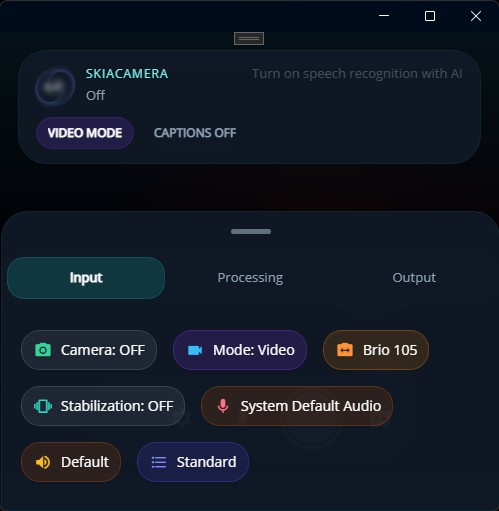
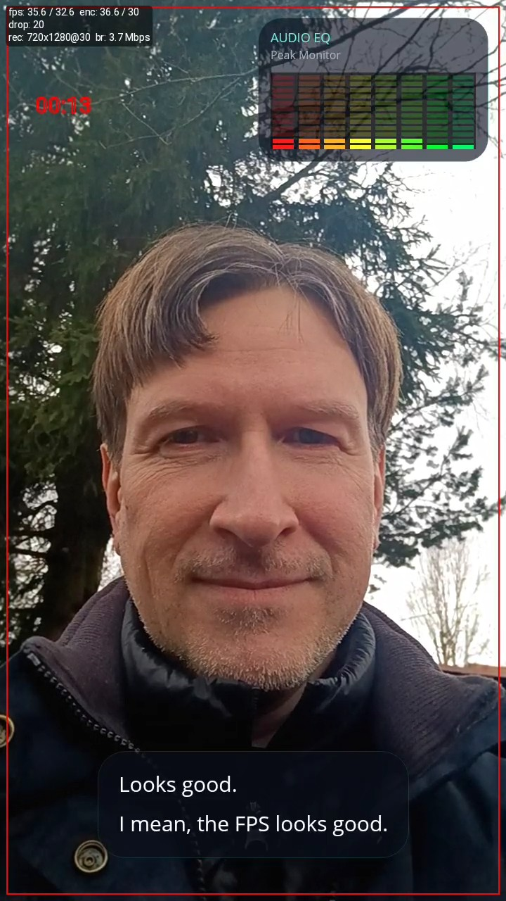

## DrawnUi.Maui.Camera

If you just need camera capture in .NET MAUI, there are solid options already: [CommunityToolkit.Maui.Camera](https://learn.microsoft.com/en-us/dotnet/communitytoolkit/maui/views/camera-view), [MediaPicker](https://learn.microsoft.com/en-us/dotnet/maui/platform-integration/device-media/picker), and platform-native APIs.

For the other kind of job: when preview and recording are part of a realtime pipeline, and you want to process frames before they hit the encoder, meet [DrawnUi.Maui.Camera](https://github.com/taublast/DrawnUi.Maui.Camera).

Best for:

- Live preview processing effects, sending to AI/ML
- Captured hi-res photo post-processing
- Processing video in real-time before encoding
- Audio live processing


*Use case: a published .NET MAUI Android app recording video with encoded overlay in real-time.*

Package provides a **SkiaCamera** control with hardware-level options such as stabilization, audio modes (raw, voice, and more), and flexible processing hooks. It is MIT-licensed and supports **iOS, MacCatalyst, Android, and Windows**.

>It is powered by **SkiaSharp** and built for realtime feed processing and post-processing. The project started with native filters on Android (**RenderScript**) and iOS (**Metal**), then moved to SKSL once SkiaSharp hardware acceleration on Windows became practical. That shift made one cross-platform processing path realistic for video and audio workflows.

## What this article covers

We will focus on the control installation and the sample app which comes along with the git repo, with demonstrated features:

- Overlays and shader effects rendered into the encoded file and over preview
- OpenAI-powered real-time captions burned into output
- Live video processing, SKSL shaders
- Pre-recording (look-back capture)

**TODO VIDEO OF APP**

For a quick visual pass you can run the sample app on mobile or even your Windows or Mac machine if you have a camera attached!

The [previous article](../SolTempo) covers the audio processing side of the pipeline.

## Control Setup

Full control docs entry point is the project [README](https://github.com/taublast/DrawnUi.Maui.Camera).

To use `SkiaCamera` in a **.NET MAUI** app, install the package, initialize DrawnUI, then host the camera inside a hardware-accelerated Skia canvas.

### Install:

```bash
dotnet add package DrawnUi.Maui.Camera
```

### Initialize 

Inside `MauiProgram.cs`:

```csharp
builder.UseDrawnUi();
```

### Consume 

Place inside your page, for example:

```xml
xmlns:draw="http://schemas.appomobi.com/drawnUi/2023/draw"
xmlns:camera="clr-namespace:DrawnUi.Camera;assembly=DrawnUi.Maui.Camera"

<Grid VerticalOptions="Fill" HorizontalOptions="Fill">
	<draw:Canvas
		HorizontalOptions="Fill"
		VerticalOptions="Fill"
		RenderingMode="Accelerated"
		Gestures="Lock">

		<camera:SkiaCamera
			x:Name="Camera"
			HorizontalOptions="Fill"
			VerticalOptions="Fill"
			BackgroundColor="Black"
			CaptureMode="Video" />

	</draw:Canvas>
</Grid>
```

Important:
* Keep the container stable: no `Auto` rows, no unset width or height requests without a `Fill`.
* For reliable saved feed orientation, lock the app or the camera page to portrait. The UI can still react to landscape rotation, and we will do that below.

### UI Orientation

By default MAUI apps rotate Ui upon device orientation, but camera encoder expects a stable orientation. Lock the whole app to portrait at the platform level, then use DrawnUI's rotation event to rotate individual icons in response to device tilt - same as a native built-in camera app, without letting the layout flip.

**Android** - `MainActivity.cs`:

```csharp
[Activity(Theme = "@style/Maui.SplashTheme",
    ScreenOrientation = ScreenOrientation.SensorPortrait,
	...
```

**iOS** - `Info.plist` (iPad needs `UIRequiresFullScreen` or the App Store may require landscape support):

```xml
<key>UIRequiresFullScreen</key>
<true/>
<key>UISupportedInterfaceOrientations</key>
<array>
	<string>UIInterfaceOrientationPortrait</string>
</array>
<key>UISupportedInterfaceOrientations~ipad</key>
<array>
	<string>UIInterfaceOrientationPortrait</string>
	<string>UIInterfaceOrientationPortraitUpsideDown</string>
</array>
```

In our sample app we respond to device rotation by rotating app icons from a DrawnUI event:

```csharp
Super.RotationChanged += OnRotationChanged;

 private void OnRotationChanged(object sender, int rotation)
 {
     var iconRotation = -NormalizeIconRotation(rotation);
     _buttonSettings.Rotation = rotation;
     _buttonFlash.Rotation = rotation;
     _buttonSelectCamera.Rotation = rotation;
 }
```

### Permissions

Set platform native permissions as documented in the [README](https://github.com/taublast/DrawnUi.Maui.Camera). Then optionally define flags so the control can request them automatically:

```csharp
Camera.NeedPermissionsSet = NeedPermissions.Camera
    | NeedPermissions.Gallery
    | NeedPermissions.Microphone;
```

### Power On/Off

Camera power is controlled by the bindable `IsOn` property. Turn it on when needed, for example after the first canvas draw:

```csharp
// can attach this event handler in XAML too
Canvas.WillFirstTimeDraw += (sender, context) =>
{
	if (CameraControl != null)
	{
		//delay camera startup to avoid too much work when starting up
		//and let the first screen render faster
		Tasks.StartDelayed(TimeSpan.FromMilliseconds(500), () =>
		{
			CameraControl.IsOn = true;
		});
	}
};
```

If you have a dedicated camera page, you can also flip `IsOn` from your page lifecycle hook. The exact hook depends on your navigation setup.

When the app goes to background, camera state is suspended and restored on resume without extra wiring in most cases.

Under the hood SkiaCamera is a wrapper for a `SkiaImage` DrawnUI control that receives GPU-backed images coming from native camera. This control is accessible via `Display` property, and we can work with it directly if needed. When camera control turns off, we can, for example, easily blur the preview: `Display.Blur = 10;`.


## Sample App

The repo sample exposes almost every relevant camera setting. Plus we have live audio visualizers, OpenAI captions encoded into final video and SKSL filters. UI is built in C# code. A XAML usage example lives in a separate repo: [DrawnUI for .NET MAUI Demo](https://github.com/taublast/DrawnUi.Maui.Demo).

App UI presents three main parts: 

* Top header for fast switching between Photo and Video modes, plus captions controls.
* Middle quick-control overlay with recording actions and a tappable capture thumbnail.
* Bottom drawer provides large camera settings organized into three sections: `Input`, `Processing`, and `Output`.

`Input` controls camera selection, capture format, and mode.
`Processing` controls realtime work: monitoring, visualizers, gain, and speech recognition.
`Output` controls what gets written: audio/video toggles, codec, pre-record settings, and geotagging.



*Input on Windows platform*

That split makes the full pipeline visible in one place: input, processing, and encoded output.

For this article, the flow is simple: keep realtime processing on, feed live audio into overlay and speech paths, then record the composed result directly into the saved video.

In the sample app, `SkiaCamera` is subclassed into `AppCamera` and configured for processed recording by default:

```csharp
public partial class AppCamera : SkiaCamera
{
	public AppCamera()
	{
		NeedPermissionsSet = NeedPermissions.Camera | NeedPermissions.Gallery | NeedPermissions.Microphone;
		InjectGpsLocation = true;

		UseRealtimeVideoProcessing = true;
		VideoQuality = VideoQuality.Standard;
		EnableAudioRecording = true;

		ProcessFrame = OnFrameProcessing;
		ProcessPreview = OnFrameProcessing;
	}
}
```

`UseRealtimeVideoProcessing = true` is the key switch.
Without it, recording is native and overlay is preview-only.
With it, every frame goes through Skia before encoding, so anything drawn in `ProcessFrame` becomes part of the file.

Both handlers receive `DrawableFrame`: it carries the destination `SKCanvas`, source camera `SKImage`, current `Scale`, and `IsPreview` flag. That flag lets us render preview and recording differently when needed. In the sample we keep one shared overlay tree, keep EQ visible in both paths, and only move captions between preview and recording modes.


## Video Recording

The actual recording flow stays straightforward:

```csharp
if (CameraControl.IsRecording)
{
	await CameraControl.StopVideoRecording();
}
else
{
	await CameraControl.StartVideoRecording();
}
```

On success, it moves the final result to the gallery:

```csharp
private async void OnVideoRecordingSuccess(object sender, CapturedVideo capturedVideo)
{
	var publicPath = await CameraControl.MoveVideoToGalleryAsync(capturedVideo, MauiProgram.Album);
	_lastSavedVideoPath = publicPath;
}
```

There is also an abort flow, useful mainly for pre-recording scenarios:

```csharp
await CameraControl.StopVideoRecording(true);
```

which discards the recording instead of finalizing it.

## Pre-Recording: Look-Back Capture

Most recording apps miss the moment. Something happens, you tap record - and the two seconds before that tap are gone.

Pre-recording solves this by running a silent circular buffer in memory continuously. Encoded frames keep flowing in and old ones drop off the tail. When you trigger live recording, the buffered segment is prepended to the file before the live feed. The final video contains both - no gap, no cut, no transition artifact.

This was built for [Racebox](https://github.com/taublast/Racebox): the app detects a car launch event automatically and starts recording, but the most interesting frames - the moment right before launch - are already in the buffer. Works equally well for sports, family moments, wildlife - anything where you can't predict when the action starts.

Enable it:

```csharp
CameraControl.EnablePreRecording = true;
CameraControl.PreRecordDuration = TimeSpan.FromSeconds(5);
```

The buffer runs silently in the background from that point on. When the user triggers recording, those last 5 seconds are already there. To abort and discard instead of saving:

```csharp
await CameraControl.StopVideoRecording(true); // true = discard
```

Both `IsPreRecording` and `IsRecording` are bindable, so record button state, labels, and animations wire up directly without extra logic.

For the full breakdown of the muxing flow see [PreRecording.md](https://github.com/taublast/DrawnUi.Maui.Camera/blob/main/PreRecording.md).

## GPS and Metadata

Enable location tagging with one flag:

```csharp
InjectGpsLocation = true;
```

Call `RefreshGpsLocation` when the camera turns on so coordinates are fresh before recording starts:

```csharp
if (CameraControl.InjectGpsLocation)
    _ = CameraControl.RefreshGpsLocation();
```

GPS is then embedded automatically - into the MP4 container for video, and into EXIF for photos. You don't touch the coordinates in your callbacks; they're already there.

For video you can still stamp branding fields into the container metadata:

```csharp
// CameraControl.RecordingSuccess += OnRecordingSuccess;
private async void OnRecordingSuccess(object sender, CapturedVideo capturedVideo)
{
	capturedVideo.Meta.Vendor = "Me";
	capturedVideo.Meta.Software = "My App";
	var publicPath = await CameraControl.MoveVideoToGalleryAsync(capturedVideo, MauiProgram.Album);
}
```

Photos get the full EXIF treatment: ISO, shutter speed, aperture, focal length, orientation, GPS, timestamp, software, vendor, model. The `Metadata` model exposes all of it before you save:

```csharp
// CameraControl.CaptureSuccess += OnCaptureSuccess;
private async void OnCaptureSuccess(object sender, CapturedImage captured)
{
	captured.Meta.Software = "My App";
	var path = await CameraControl.SaveToGalleryAsync(captured, "MyAppAlbum");
}
```

Whether GPS is displayed depends on the gallery or player reading the file, but the data is in there.

## Drawn Overlay

SkiaCamera virtual methods `RenderPreviewForProcessing` or `RenderFrameForRecording` are used to prepare the SkCanvas that would then be passed to callbacks `ProcessPreview` or `ProcessFrame` so we could optionally draw over the frames. 

Inside callbacks we can of course use SkiaSharp primitives like `SKCanvas.DrawText`, `DrawRect`, and others.

When drawing some complex controls we can compose overlays with DrawnUI layouts.

Our overlay contains two visible modules:

- an audio visualizer panel in the top-right corner
- a captions panel rendered with `SkiaRichLabel`

```csharp
new SkiaShape()
{
	Type = ShapeType.Rectangle,
	UseCache = SkiaCacheType.ImageDoubleBuffered,
	Margin = 16,
	Padding = new Thickness(12, 10, 12, 12),
	WidthRequest = 220,
	HeightRequest = 138,
	CornerRadius = 22,
	VerticalOptions = LayoutOptions.Start,
	HorizontalOptions = LayoutOptions.End,
	Children =
	{
		new AudioVisualizer()
		{
			Margin = new Thickness(0, 42, 0, 0),
			HorizontalOptions = LayoutOptions.Fill,
			VerticalOptions = LayoutOptions.Fill,
		}
	}
}
```

Notice we used ImageDoubleBuffered cache type for equalizer so that it doesn't slow our frame rendering, Cache would then calculate/draw in background while we fast-draw the last raster. 

The EQ panel can stay where it is for both preview and recording. Captions are different. During preview the app HUD is large and sits over the lower part of the camera feed, so bottom-aligned captions would fight with the controls. For that reason the sample centers the captions panel vertically while drawing preview frames, then moves it back toward the bottom for recorded frames.

Code locations in sample app:

- Overlay composition and captions visual effects: `src/Sample/UI/FrameOverlay.cs`
- Overlay rendering and scaling against frame data: `src/Sample/UI/AppCamera.cs` (`DrawOverlay` and `OnFrameProcessing`)
- Captions feed and transcription wiring: `src/Sample/UI/MainPage.cs`

In `AppCamera.DrawOverlay`, we adapt both by mode and scale.
`layout.AdaptLayoutToMode(frame.IsPreview)` switches preview vs recording caption placement, and `overlayScale` is computed from `frame.Scale` plus camera format so the same layout stays visually stable across preview and encoded frames.

>To know the camera control location on the SkiaSharp canvas we can use camera property `SKRect DrawingRect`. When property `Aspect` is not set to `Fill` but rather to `Fit` we could have "black bars" around the real displayed frame, but then we can use `SKRect DisplayRect` property to get exact area where rescaled preview is drawn on the canvas.

## SKSL Video Filters 

We apply video filters, implemented with SKSL shaders to preview, captured photo and captured video.

Because every frame passes through Skia before encoding, SKSL effects can be applied to recorded video in real-time. The saved MP4 will contain filtered frames, no post-processing needed.

The sample app exposes a `VideoEffect` helper property on `AppCamera`:

**TODO SCREENSHOT OF FILTER EXAMPLE**

```csharp
CameraControl.VideoEffect = ShaderEffect.Movie;
```

`AppCamera` overrides both `RenderPreviewForProcessing` and `RenderFrameForRecording` to apply the selected shader effect before handing frames to preview or encoder. Same effect, same path, different target.

Switch to `ShaderEffect.None` and you are back to clean capture. Switch mid-session and the filter change shows up in the file from that point forward.

Captured still photo is processed before saving to gallery on GPU thread:

```csharp
private async void OnCaptureSuccess(object sender, CapturedImage captured)
{
	if (CameraControl.UseRealtimeVideoProcessing && CameraControl.VideoEffect != ShaderEffect.None)
	{
		var imageWithEffect = await CameraControl.RenderCapturedPhotoAsync(captured, null, image =>
		{
				var shaderEffect = new SkiaShaderEffect()
				{
					ShaderSource = ShaderEffectHelper.GetFilename(CameraControl.VideoEffect),
				};
				image.VisualEffects.Add(shaderEffect);
		}, true);

		captured.Image.Dispose();
		captured.Image = imageWithEffect;
	}

	SaveFinalPhotoInBackground(captured);
}
```

This is from `MainPage.OnCaptureSuccess` in the sample app.

The sample ships with several SKSL presets to play with, and adding your own is a matter of writing a standard SKSL fragment shader.

Shader assets live in the sample under `src/Sample/Resources/Raw/Shaders`.

## AI Speech Captions

In the next article we will surely feed video data to ML to detect faces in realtime. Today let's feed audio to AI. Our sample transcribes speech through **OpenAI Whisper** (`whisper-1` model) via the `https://api.openai.com/v1/audio/transcriptions` endpoint. The service lives in `src/Sample/Services/OpenAi/OpenAiAudioTranscriptionService.cs`.

Real-time speech transcription is wired like this:

```csharp
CameraControl.AudioSampleAvailable += (data, rate, bits, channels)
    => OnAudioCaptured(data, rate, bits, channels);
```

We feed incoming PCM into the OpenAi service:

```csharp
private void OnAudioCaptured(byte[] data, int rate, int bits, int channels)
{
	if (_realtimeTranscriptionService != null && IsSpeechEnabled)
	{
		if (rate != _lastAudioRate || bits != _lastAudioBits || channels != _lastAudioChannels)
		{
			_lastAudioRate = rate;
			_lastAudioBits = bits;
			_lastAudioChannels = channels;
			_realtimeTranscriptionService.SetAudioFormat(rate, bits, channels);
		}

		_realtimeTranscriptionService.FeedAudio(data);
	}
}
```

To enable AI captions, open `src/Sample/Secrets.cs` and paste your OpenAI key:

```csharp
public static string OpenAiKey = "sk-...";
```

Without a key the sample compiles and runs normally - AI captions are simply disabled.

We can draw received text onto our overlay:

```csharp
_captionsEngine.CaptionsChanged += spans =>
	MainThread.BeginInvokeOnMainThread(()
        => _previewFrameOverlay.SetCaptions(spans));
```

We marshal this callback to the UI thread because caption updates mutate DrawnUI controls (`SkiaRichLabel` text and visibility). Those updates must be serialized on the main thread to avoid cross-thread UI access issues.



*Recorded on Android, encoded captions, EQ and debug info*

Captions are drawn as follow:

```csharp
new SkiaShape()
{
	UseCache = SkiaCacheType.Image,
	Type = ShapeType.Rectangle,
	CornerRadius = 26,
	Margin = new Thickness(20, 0, 20, 40),
	Padding = new Thickness(20, 16, 20, 18),
	HorizontalOptions = LayoutOptions.Center,
	VerticalOptions = LayoutOptions.End,
	Children =
	{
		new SkiaRichLabel()
		{
			FontFamily = "FontText",
			FontSize = 20,
			LineHeight = 1.1,
			TextColor = Colors.White,
			UseCache = SkiaCacheType.Operations,
		}
	}
}
```

Caption lifetime is managed by `RealtimeCaptionsEngine` as a rolling window. Each finalized paragraph is kept until either a newer paragraph pushes it past `maxLines` (3 by default), or the most recently added paragraph's timer expires. Older paragraphs are no longer removed individually on a per-line timer — they only roll off when displaced, which keeps the visible history stable while the user is still talking.

When the last paragraph's timer finally expires (and no partial is currently being typed), the whole container is cleared and we apply a shader so it dissolves instead of popping out:

```csharp
void AnimateOut(SkiaControl control)
{
	var animExit = new AnimatedShaderEffect()
	{
		UseBackground = PostRendererEffectUseBackgroud.Once,
		ShaderSource = MauiProgram.ShaderRemoveCaption,
		DurationMs = 400
	};

	control.VisualEffects.Add(animExit);
	animExit.Play();
}
```

Since the same overlay handles both preview and recording, captions stay visible live and are burned into the final video with no second export pass. The only layout difference is where they sit: centered during preview so the app HUD does not cover them, then bottom-aligned in the recorded output.


## Final thoughts

If your app needs branded recording, AI-assisted media, sports telemetry, guided capture, captions, or audio-reactive overlays, this control is designed for that class of workflow.

If you build something cool with it, let me know. I’d be happy to see it help other builders too. PRs are welcome!

## Links and resources

- [DrawnUi.Maui.Camera](https://github.com/taublast/DrawnUi.Maui.Camera) - SkiaCamera control repository with sample app and documentation
- [Real-Time Camera Filters](../FiltersCamera/) - earlier post about using SKSL shaders with SkiaCamera
- [Building a Real-time Audio Processing App](../SolTempo/) - earlier post about using SkiaCamera for audio
- [DrawnUI for .NET MAUI](https://github.com/taublast/DrawnUi) - UI rendering engine behind this control
- [SkiaSharp](https://github.com/mono/SkiaSharp) - the underlying 2D graphics library making this all possible

---

 *The author is available for consulting and works on drawn applications and custom controls for .NET MAUI. If you need help creating custom UI experiences, optimizing performance, or building entirely drawn apps, feel free to reach out.*

