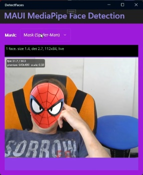

## Intro

Mobile and desktop devices can detect almost anything in images today, starting with QR codes and ending with the number of calories in displayed food. There are many ways to do this on platforms supported by **.NET MAUI**. Various local ML engines such as **TensorFlow Lite**, native platform-only SDKs like **ARKit** for iOS, or remote vision API endpoints, can all play a role. It is all up to your app architecture and implementation.

When it comes to running detection over a live camera feed, the `DrawnUi.Maui.Camera` NuGet package is a good choice. In our [previous article](../VideoRecording/) I already showed how to use `SkiaCamera` to send real-time audio to AI. Today I will use it to demonstrate **live face detection**.

The [sample app](https://github.com/taublast/DetectFaces) included with this article sets up **MediaPipe** local face landmark detection. I chose it for maximum cross-platform consistency, and it runs the same way on **iOS, Android, and Windows**.

It also draws overlays and makes face masks stick to moving heads.


<div class="video-container-github">
<video controls muted autoplay loop playsinline>
  <source src="../../assets/vids/masks.mp4" type="video/mp4">
  Your browser does not support the video tag.
</video>
</div>

---

Please note that today our goal will be to show **how to use SkiaCamera live video frames for AI/ML locally and with an API** in general, not to dive deep into sample app specific architecture.

## The Setup

Please refer to the [previous article](../VideoRecording/) on how to install and initialize `SkiaCamera` control. You would see in the sample that we are using XAML to drop our subclassed control into a usual MAUI layout.

For AI/ML purposes we need to enable its processing pipeline:

```csharp
UseRealtimeVideoProcessing = true;
```

## The Plug

Now when `SkiaCamera` runs a live preview, the images you see on the screen remain on GPU-backed surfaces during the processing flow. To use them outside that GPU camera path, we need to extract frames at the size we need into CPU memory. For that, we override `OnRawFrameAvailable(RawCameraFrame frame)`.

The received `RawCameraFrame` struct holds a GPU-backed `SKImage` along with some metadata.

Normally now you would need to scale down the image, orient it properly and in some cases zoom a bit to remove irrelevant margins. We have all the tools for that.

## For Local ML

`RawCameraFrame` struct exposes `TryGetRgba(width, height, buffer, orientation, cropRatio)` method, which fills a pre-allocated `byte[]` with RGBA pixels at the final size you need for your model.

The sample app uses `cropRatio` of default 1 - no zooming, `orientation` of default `OutputOrientation.Display` - we don't care if the image is "head-up"; we just want exactly what device display is showing even if rotated in landscape.

If for your ML you want a "head-up" rotation you can use `OutputOrientation.Portrait` instead. Also you might want to crop the image, for example to cut borders if you need to detect an object that is most probably in the center. You can reduce `cropRatio` for that. For example, `0.9` would mean you cut `0.1` from borders.

Our sample just calls with method defaults, not even passing `orientation, cropRatio)`:

```csharp
    if (!frame.TryGetRgba(targetWidth, targetHeight, _mlFrameBuffers[writeBufferIndex]))
        return;
```

Even for local ML, the safest default is to drop frames while the detector is still busy. That applies not only to faces, but also to QR scanning, OCR, lightweight object detection, classification, or any model that runs continuously over live preview. It is better to skip frames than to make the camera preview lag.

Here is an example for some abstract ML use case: no camera-thread blocking, no unbounded queue, and explicit frame dropping while work is already in flight:

```csharp
private readonly byte[] _rgbaBuffer = new byte[targetWidth * targetHeight * 4];
private readonly SemaphoreSlim _detectorBusy = new(1, 1);

protected override void OnRawFrameAvailable(RawCameraFrame frame)
{
    if (!_detectorBusy.Wait(0))
        return;

    if (!frame.TryGetRgba(targetWidth, targetHeight, _rgbaBuffer, OutputOrientation.Portrait, 0.8f))
    {
        _detectorBusy.Release();
        return;
    }

    var snapshot = _rgbaBuffer.ToArray();

    _ = Task.Run(async () =>
    {
        try
        {
            await detector.EnqueueDetectionAsync(snapshot, request);
        }
        finally
        {
            _detectorBusy.Release();
        }
    });
}
```

The following example is more optimized: we replace the `ToArray()` snapshot with a small reusable buffer pool and submit work into a detector-owned pipeline instead of wrapping that handoff in another `Task.Run`:

```csharp
private readonly byte[][] _mlBuffers =
[
    new byte[targetWidth * targetHeight * 4],
    new byte[targetWidth * targetHeight * 4]
];
private const float MlCropRatio = 1f;
private readonly object _detectionSync = new();
private int _activeBufferIndex = -1;
private DetectionWorkItem? _queuedDetectionWorkItem;

protected override void OnRawFrameAvailable(RawCameraFrame frame)
{
    DetectionWorkItem? workItemToSubmit = null;

    lock (_detectionSync)
    {
        int writeBufferIndex = _activeBufferIndex == 0 ? 1 : 0;

        if (!frame.TryGetRgba(targetWidth, targetHeight, _mlBuffers[writeBufferIndex], OutputOrientation.Portrait, MlCropRatio))
            return;

        var workItem = new DetectionWorkItem(
            writeBufferIndex,
            targetWidth,
            targetHeight,
            0);

        if (_activeBufferIndex >= 0)
        {
            _queuedDetectionWorkItem = workItem;
            return;
        }

        _activeBufferIndex = workItem.BufferIndex;
        workItemToSubmit = workItem;
    }

    detectionPipeline.Submit(workItemToSubmit);
}
```

Detector already owns the background pipeline here, `OnRawFrameAvailable(...)` will only prepare the frame and decide whether to drop or queue it, and hand the request off afterwards. Completion callbacks would later release the active buffer and, if needed, submit the newest queued frame. Because this sample uses `OutputOrientation.Display`, the detector buffer is already aligned to the live preview, so there is no extra detector-space rotation left to project afterwards.

## For AI API

Our app uses local ML, but the same raw-frame hook would be used if we wanted to use frames with some API.

For performance reasons we should not try to upload every preview frame, but, for example, allow one send at most every 300 ms, and also skip sending frames until the previous request has returned. 

For public LLM vision APIs I would send JPEG or PNG, not raw RGBA bytes. The same `cropRatio` parameter is available there as well:

```csharp
private const int RemoteUploadIntervalMs = 300;
private long _lastUploadStartedAtMs;
private readonly SemaphoreSlim _uploadGate = new(1, 1);

protected override void OnRawFrameAvailable(RawCameraFrame frame)
{
    if (!_uploadGate.Wait(0))
        return;

    long nowMs = Environment.TickCount64;
    if (nowMs - _lastUploadStartedAtMs < RemoteUploadIntervalMs)
    {
        _uploadGate.Release();
        return;
    }

    if (!frame.TryGetJpeg(targetWidth, targetHeight, out var payload, 100, OutputOrientation.Portrait, 1f))
    {
        _uploadGate.Release();
        return;
    }

    _lastUploadStartedAtMs = nowMs;

    _ = Task.Run(async () =>
    {
        try
        {
            await apiClient.UploadImageAsync(payload, "image/jpeg");
        }
        finally
        {
            _uploadGate.Release();
        }
    });
}
```

`SemaphoreSlim.Wait(0)` is doing the neat part here: it never blocks the camera callback, but it also guarantees that only one upload can be in flight at a time. Once inside that gate we can check the 300 ms minimum delay and update the timestamp without extra threading helpers. If the network call takes longer than 300 ms, the in-flight gate still wins and newer frames are skipped.

`TryGetJpeg(...)` or `TryGetPng(...)` return a standard encoded image payload at the final orientation and size you requested.

For custom endpoints that expect raw `RGBA8888` data you can still use `TryGetRgbaBytes(...)`.

## Debug The Image

If you need to verify what you are actually sending to AI/ML, you can save one debug frame to the device gallery and inspect it visually. That gives you a simple way to confirm orientation, crop, and scale instead of assuming anything. Just don't forget to enable gallery access for your app, see `SkiaCamera` [control readme](https://github.com/taublast/DrawnUi.Maui.Camera) on how to do that.

If your app already uses `TryGetJpeg(...)`, the simplest path is to save that exact JPEG payload:

```csharp
private bool _saveNextDebugFrame; //set this to true when you want to save frame to gallery

protected override void OnRawFrameAvailable(RawCameraFrame frame)
{
    if (_saveNextDebugFrame &&
        frame.TryGetJpeg(targetWidth, targetHeight, out var payload, 100, OutputOrientation.Portrait, 1f))
    {
        _saveNextDebugFrame = false;

        _ = Task.Run(async () =>
        {
            using var stream = new MemoryStream(payload);
            await NativeControl.SaveJpgStreamToGallery(
                stream,
                $"ml_debug_{DateTime.Now:yyyyMMdd_HHmmss}.jpg",
                new Metadata(),
                "DebugAlbum");
        });
    }

    // normal ML or API flow continues here...
}
```

If your app normally uses `TryGetRgbaBytes(...)`, you can still inspect the same transformed image by encoding the returned RGBA buffer to JPEG and saving that to the gallery:

```csharp
private bool _saveNextDebugFrame;

protected override void OnRawFrameAvailable(RawCameraFrame frame)
{
    if (_saveNextDebugFrame &&
        frame.TryGetRgbaBytes(targetWidth, targetHeight, out var rgbaBytes, OutputOrientation.Portrait, 1f))
    {
        _saveNextDebugFrame = false;

        _ = Task.Run(async () =>
        {
            var imageInfo = new SKImageInfo(
                targetWidth,
                targetHeight,
                SKColorType.Rgba8888,
                SKAlphaType.Unpremul);

            using var image = SKImage.FromPixelCopy(imageInfo, rgbaBytes, imageInfo.RowBytes);
            using var data = image.Encode(SKEncodedImageFormat.Jpeg, 100);
            using var stream = data.AsStream();

            await NativeControl.SaveJpgStreamToGallery(
                stream,
                $"ml_debug_rgba_{DateTime.Now:yyyyMMdd_HHmmss}.jpg",
                new Metadata(),
                "DebugAlbum");
        });
    }

    // normal ML flow continues here...
}
```

The smaller size you request the faster will the `GPU scaled -> CPU result` transfer be.
 
## The Sample App

Now that you know how to get images to use with AI/ML, reading app source code might be easier. I have included more docs: [Implementation.md](https://github.com/taublast/DetectFaces/blob/main/src/Implementation.md) explaining the architecture, and [Includes.md](https://github.com/taublast/DetectFaces/blob/main/src/Includes.md) which explains how ML models are shipped inside app resources for each platform. The setup can be adapted to other `MediaPipe Tasks` by swapping models and parsing different outputs.



To be able to draw bitmap masks like a Spider-Man mask or a funny hat, we use configurations to position them relatively to detected face:

```csharp
                    config = ModePicker.SelectedIndex switch
                    {
                        3 => new MaskConfiguration
                        {
                            Filename = "hat_cake.png",
                            Position = MaskPosition.Top,
                            WidthMultiplier = 1.6f,
                            YOffsetRatio = 0.05f
                        },
                        _ => new MaskConfiguration
                        {
                            Filename = "mask_spiderman.png",
                            Position = MaskPosition.Inside,
                            WidthMultiplier = 1.25f,
                            YOffsetRatio = -0.2f
                        }
                    };

                    await CameraControl.SetupMaskAsync(config);
```

If you choose to create your own mask, you can easily create more configs on top of the existing ones.

To be able to draw these with max fps we store currently loaded bitmap inside a GPU-backed texture:

```csharp
   //load image from resources
   using var stream = await FileSystem.OpenAppPackageFileAsync(config.Filename);
   using var managed = new MemoryStream();
   await stream.CopyToAsync(managed);
   managed.Position = 0;

   MaskBitmap = SKBitmap.Decode(managed);
   
   //exec on GPU thread: store bitmap in GPU texture
   SafeAction(() => //execute at the end of SkiaSharp canvas drawing
   {
       using var gpu = this.CreateSurface(MaskBitmap.Width, MaskBitmap.Height, isGpu: true);
       gpu.Canvas.Clear(SKColors.Transparent);
       gpu.Canvas.DrawBitmap(MaskBitmap, 0, 0);
       gpu.Canvas.Flush();
       MaskImage = gpu.Snapshot();
   });
```

Then we can draw our `MaskImage` inside the SkiaCamera callback `ProcessFrame` with appropriate projected rotation and position.

The same drawing code we use in the `ProcessFrame` hook is also used when saving captured still photos. A photo can be very large, for example `4000x3000`, and if we draw detected frames or landmark dots with the wrong stroke width those SkiaSharp primitives would become almost invisible at that pixel size. We solve this by scaling stroke width from a safe 300-pixel baseline:

```csharp
var density = Math.Min(frame.Width, frame.Height) / 300f; 
_paintDetectionDotsStroke.StrokeWidth = Math.Max(2f, 2f * density); 
//draw landmarks points
frame.Canvas.DrawPoints(SKPointMode.Points, pts, _paintDetectionDotsStroke);
```

This keeps all masks visually consistent between live preview and the final still photo.

In order to smooth mask overlay movement we use a One Euro filter. It runs per landmark, separately for X and Y, so a still face gets strong jitter suppression while a moving face gets much less added lag. Another prediction step extrapolates from the two latest detections, which helps compensate for detector latency when the head moves quickly. 


### What Else You Can Detect

The architecture - `MediaPipeTasksVision` on mobile, `Mediapipe.Net` TFLite graphs on Windows - generalizes to other tasks by swapping the model file and parsing different output structures:

- **Hand landmarks** (`hand_landmarker.task`) - 21 3D joint points per hand, gesture control, sign language
- **Pose landmarks** (`pose_landmarker.task`) - 33 body joints, fitness tracking, motion capture
- **Object detection** (`efficientdet.task`) - bounding boxes with class labels
- **Image segmentation** (`image_segmenter.task`) - per-pixel foreground/background separation (the Zoom background blur mechanism)
- **Image classification** - whole-image category labels

**The hard parts** - unmanaged memory safety on Windows, async frame queue, landmark smoothing - are **already solved** in the sample. Adding a new task is mostly parsing a different output.

### Used Packages

* Windows: `Mediapipe.Net` and `Mediapipe.Net.Runtime.CPU`.
* iOS: `MediaPipeTasksVision.iOS` from the [MediaPipeTasks](https://github.com/v-hogood/MediaPipeTasks) project.
* Android: `AppoMobi.Preview.MediaPipeTasksVision.Android`, which is a `MediaPipeTasksVision.Android` fork [with extra methods](https://github.com/taublast/MediaPipeTasks/tree/bulkpts) for bulk landmark read-back to reduce frame processing time by about 3x. A PR is pending in the main repo, so later it may be possible to switch back to the original NuGet package from [MediaPipeTasks](https://github.com/v-hogood/MediaPipeTasks).

## Final Thoughts

Sending frames from a live camera preview to a local ML model or remote API in .NET MAUI is very approachable. The performance numbers in the sample app's status bar make it easier to tune the pipeline for your target device.

I hope you find this article useful. If it helps you build something, please let me know.   Feel free to ask your questions in comments!

## Links and Resources

- [DetectFaces](https://github.com/taublast/DetectFaces) - sample app with all platforms implemented, source for everything in this article
- [DrawnUi.Maui.Camera](https://github.com/taublast/DrawnUi.Maui.Camera) - `SkiaCamera` control
- [AI Captions and Live Video Processing in .NET MAUI](../VideoRecording/) - previous article in this series
- [MediaPipe Tasks Vision - Android](https://ai.google.dev/edge/mediapipe/solutions/vision/face_landmarker/android) - official Android MediaPipe docs
- [MediaPipe Tasks Vision - iOS](https://ai.google.dev/edge/mediapipe/solutions/vision/face_landmarker/ios) - official iOS MediaPipe docs
- [One Euro Filter](https://gery.casiez.net/1euro/) - the adaptive smoothing algorithm used for mask stabilization
- [DrawnUI for .NET MAUI](https://github.com/taublast/DrawnUi) - the rendering engine behind SkiaCamera
- [SkiaSharp](https://github.com/mono/SkiaSharp) - the 2D graphics library this all runs on

---

*The author is available for consulting and works on drawn applications and custom controls for .NET MAUI. If you need help with custom UI experiences, optimizing performance, or building drawn mobile apps, feel free to reach out.*
