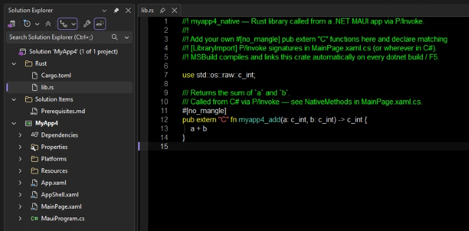

## Speed It Up

What if some part of your **.NET MAUI** app becomes too heavy?

Not the whole app. Just that one slice that does heavy work like data or image processing, case of parsers, codecs, crypto, simulation code, or any hot path where you want tighter control over allocations and native-level throughput.

That is where you might think using **Rust** for this would totally make sense.

Rust is a programming language in the same performance league as C++. And if you have already spent time looking at GC freezes, allocation spikes, or jitter in an animation loop, you might enjoy the "no garbage collector" concept.

WIth the beginning of an AI era, it might be a very good time to start using Rust inside **.NET MAUI** apps. So let's find a way to do it seamlessly. 

Spoiler: toward the end of the article we could create a MAUI-Rust project from a .NET template.

## Edit & Hit F5

To make Rust and MAUI code work together in a best way, we will need to have both projects inside a single solution. 

After we finish editing either Rust or C# code, our MAUI project should build them all, for **Android, iOS, MacCatalyst or Windows**.

Let's look at [our article's example](https://github.com/taublast/MauiRust), where all of this was implemented:

```text
MauiRust/
├── src/
│   └── MauiRust/
│       ├── AppShell.xaml
│       ├── MainPage.xaml
│       ├── MainPage.xaml.cs
│       └── MauiRust.csproj
├── rust/
│   ├── Cargo.toml
│   └── lib.rs
└── MauiRust.sln
```

Here when you press **F5** or build from the command line, MAUI project starts to build Rust too. **MSBuild** picks the active platform, runs the matching Cargo command for that target, produces the native library, and makes sure that binary is copied or packaged where the app expects it.

## The Happy Marriage

```xml
<Label Text="C# draws the rectangle. Rust draws the circle." />
```

Our sample app logic is intentionally simple, but both language ecosystems share something special: a **SkiaSharp** canvas. MAUI app hosts the canvas, draws a rectangle on it, and passes the handle to Rust so it draws his circle there.

TODO insert image

The circle is not the point, imagine replacing it with some computing, geometry processing, compression, or anything complex requiring blazing speed.

## The MAUI-Rust App Template

I created a nuget package [Community.MauiRust.Templates](https://github.com/taublast/Community.MauiRust.Templates) to summon a new Rust-ready **.NET MAUI** app in a quick way.

Install from NuGet:

```bash
dotnet new install Community.MauiRust.Templates
```

Then create a new app like this:

```bash
dotnet new maui-rust -n MyApp
```

This brings a clean **.NET MAUI** app with the all the **Rust** boilerplate already wired for **Windows, Android, iOS, and Mac Catalyst**. The crate is there, the MAUI project structure is ready, and the build system will be ready to compile and package everything together.



This could serve as a starting point for interesting experiments with Rust, which might evolve into great projects.

Please don't forget to update your installed templates from time to time:

```bash
dotnet new update
```

## How This Works

### The Build System

All is wired inside the MAUI `csproj` file:

```xml
<Target Name="BuildRustNative" BeforeTargets="BeforeBuild;CollectNativeReferences" Condition="'$(RustTargetTriple)' != ''">
    <Message Importance="high" Text="==&gt; $(RustCargoCommand)" />
    <Exec Command="$(RustCargoCommand)" WorkingDirectory="$(RustCrateDir)" />
</Target>
```

Per target framework, the project selects the right Rust target and packaging behavior.

- Windows builds `testrust_native.dll` for `x86_64-pc-windows-msvc` and copies it next to the app executable.
- Android uses `cargo ndk` and packages `libtestrust_native.so` for both `arm64-v8a` and `x86_64`.
- iOS builds `libtestrust_native.a` and links it through `NativeReference`.
- MacCatalyst builds `libtestrust_native.dylib` and bundles it as a dynamic native reference.

We target `net10.0-android` by default, then conditionally add more target frameworks depending on the build host:

- on macOS: `net10.0-ios` and `net10.0-maccatalyst`
- on Windows: `net10.0-windows10.0.19041.0`


TODO About prerequisites

### Interop

Once the app is running, `Rust.cs` declares the library imports with `[LibraryImport]` and `MainPage.xaml.cs` calls across the FFI boundary:

```csharp
[LibraryImport("testrust_native")]
public static partial int testrust_draw_circle(
    IntPtr canvas,
    float cx,
    float cy,
    float radius,
    uint colorArgb);

var rc = Rust.DrawCircle(canvas.Handle, cx, cy, radius, colorArgb);
```

This is the point where we reach the **foreign function interface**, or FFI, boundary. Managed C# is calling a native Rust function through a small C-style ABI.

### The Rust Side

The Rust crate is configured as both `cdylib` and `staticlib`:

```toml
[lib]
crate-type = ["cdylib", "staticlib"]
```

That is not just build-system decoration. It reflects the platform strategy.

On Windows, Android, and MacCatalyst, the sample dynamically resolves the `sk_*` functions exported by `libSkiaSharp` using `libloading`. On iOS device builds, where dynamic loading is restricted, the same symbols are resolved by static linking instead.

So the crate is doing two useful things at once:

1. It exposes a simple native API to C#.
2. It talks to the same Skia implementation the MAUI app already uses.

That second point is the real win. The Rust code is not introducing another rendering stack just to prove interop works.

## Adding Rust Code

Once you add a new function in Rust, how do you make MAUI call it?

### 1. Export the function from Rust

Inside `rust/lib.rs`, add a public `extern "C"` function and mark it with `#[no_mangle]` so the symbol name stays visible to the .NET side.

For example:

```rust
#[no_mangle]
pub extern "C" fn testrust_add(left: i32, right: i32) -> i32 {
    left + right
}
```

That gives the native library a simple C-compatible export that .NET can call.

For this style of interop, keep the ABI simple when possible:

- primitive numbers like `i32`, `u32`, `f32`, `f64`
- raw pointers when you need to pass native handles or buffers
- `#[repr(C)]` structs when you need shared structured data

### 2. Declare the same function on the C# side

Open `Rust.cs` and declare the same function inside the `Rust` class.

```csharp
[LibraryImport(Lib, EntryPoint = "testrust_add")]
[UnmanagedCallConv(CallConvs = new[] { typeof(System.Runtime.CompilerServices.CallConvCdecl) })]
public static partial int Add(int left, int right);
```

The important part is that the C# signature must match the Rust signature exactly in parameter order, types, and return type.

That is where most early mistakes happen.

If Rust says `i32`, C# should say `int`. If Rust returns a pointer, C# should not pretend it is a string or an object. If Rust expects a C calling convention, the C# declaration should state that too.

### 3. Call it from MAUI code

Once that declaration exists, you call it like any other static method:

```csharp
var sum = Rust.Add(2, 3);
```

At that point there is nothing especially magical left about the call. The MAUI part is simply where your C# code lives.

### 4. Build and run normally

This sample wires Cargo into the MAUI project file, so after adding a Rust function and its matching C# declaration, you just build the app the usual way.

- press `F5` in Visual Studio
- or run `dotnet build`

The Rust crate is rebuilt by the MAUI project, and the produced native library is copied or packaged for the active platform.

That is the real convenience this repository demonstrates. You do not need a separate manual compile-copy-run ritual every time you add one more exported Rust function.

### 5. If something goes wrong

When the signature does not match, native interop tends to fail badly and not always politely. So for new functions, keep the first version boring:

- start with integers, floats, or pointers
- avoid strings until the simple path works
- if you need structs, mark them with `#[repr(C)]`
- if a Rust function reports failure, expose an error accessor like `testrust_last_error()` and read it from C#

That last pattern is already used in this sample, and it is worth copying.


## Final Thoughts

The MAUI-Rust template opens the door to very practical uses:

- image and data processing
- codecs, parsers, and native data pipelines
- simulation or geometry-heavy work
- native API experiments where low-level control matters

All still inside what .NET MAUI is best at: application structure, cross-platform, and .NET productivity.

While this could be a convinient way to integrate Rust code into .NET MAUI apps, I am sure an even more seamless way would emerge due to .NET community efforts. Please feel to contribute to [the repo](https://github.com/taublast/Community.MauiRust.Templates).


## Links and Resources

- [Community.MauiRust.Templates](https://github.com/taublast/Community.MauiRust.Templates) package 
- [MauiRust Sample](https://github.com/taublast/MauiRust) for this article, sharing SkiaSharp canvas with Rust  
- [Working with Rust Libraries from C# .NET Applications](https://khalidabuhakmeh.com/working-with-rust-libraries-from-csharp-dotnet-applications) for a practical walkthrough for .NET + Rust
- [Building with .NET and Rust: A Tale of Two Ecosystems](https://www.woodruff.dev/building-with-net-and-rust-a-tale-of-two-ecosystems/) with an ecosystem-level comparison
- [Native Library Interop for .NET MAUI](https://learn.microsoft.com/en-us/dotnet/communitytoolkit/maui/native-library-interop/) guidance
- [Creating Bindings for .NET MAUI with Native Library Interop](https://devblogs.microsoft.com/dotnet/native-library-interop-dotnet-maui/) covers Java, Kotlin, Swift, and Objective-C wrapper flows

---

*The author is available for consulting and works on performance-sensitive apps, drawn applications, and custom controls for .NET MAUI. If you need help with custom UI, native interop, or performance work, feel free to reach out.*