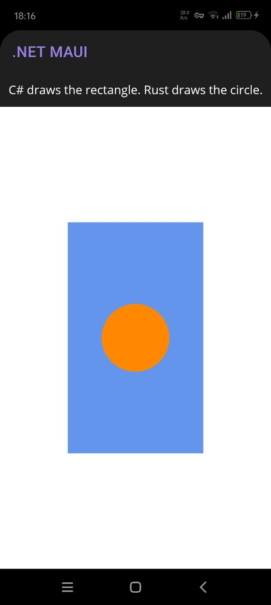

## When Performance Starts to Matter

What if a slice of your **.NET MAUI** app becomes too heavy? Not the whole app, but just that part maybe doing some data or image processing, calculations and similar, and you start to wonder where to go from here.

That is exactly where the idea of using **Rust** inside your app starts looking very attractive.

Rust lives in the same performance league as C++, but with a much friendlier safety story. You might have already heard of teams taking a course toward the use of **Rust**, replacing existing code. And if you have spent time chasing GC spikes or trying to keep a rendering path smooth, the absence of garbage collector become very appealing.

Enough said, can we make it feel natural to use **Rust** inside a **.NET MAUI** app? 

Today's answer is **yes**, and we will use a .NET tool to set all up. Our workflow will be consistent on **Android, iOS, MacCatalyst and Windows**.

## Wiring Rust Into MAUI

For the purposes of this article we will build a real SkiaSharp sample where C# and Rust will draw on the same  **SkiaSharp** canvas to demonstrate how **MAUI** and **Rust** can share a context. 

Let's install a dedicated tool and generate a new app from it. You could also apply this tool to an existing app, but more on this later.  We start with installing [RustMaui](https://github.com/taublast/RustMaui):

```bash
dotnet tool install --global RustMaui
```

If you already had an existing MAUI app, the tool could wire Rust to it:

```bash
rustmaui init path/to/MyApp.csproj
```

If you are already inside the app directory and it contains exactly one `.csproj`, the shorter form also works:

```bash
rustmaui init .
```

That would add the Rust crate and the generator package without replacing your existing app files.

But in our sample case we will create a new app:

```bash
rustmaui new UseSkiaSharp
```

The following would be generated:

```text
UseSkiaSharp/
├── check-prerequisites.ps1
├── check-prerequisites.sh
├── Prerequisites.md
├── rust/
│   ├── Cargo.toml
│   ├── lib.rs 
├── src/
│   └── UseSkiaSharp/
│       ├── AppShell.xaml
│       ├── MainPage.xaml
│       ├── MainPage.xaml.cs
│       ├── MauiProgram.cs
│       └── UseSkiaSharp.csproj
└── UseSkiaSharp.sln
```
Before the first build, check prerequisites. If they are not met, the first build fails early and the error is usually quite direct: missing MAUI workloads, missing `cargo`, missing Rust targets, missing `cargo-ndk`, missing Xcode tools on macOS, or on Windows a missing MSVC linker.

As you might see the generated app contains a [Prerequisites.md](https://github.com/taublast/RustMaui/blob/master/samples/UseSkiaSharp/Prerequisites.md), If you open the generated `.sln` file you would see it inside `Solution items`. There are also helper scripts included for checking the environment to make sure you have all required for Rust code to be built. Scripts will tell you what is missing and print the fix command or install link.

Once the checker looks good, build the app:

```bash
dotnet build
```

That gives us a clean **.NET MAUI + Rust** app with the Rust crate already wired into the MAUI project, everything compiles together. Rust library will be automatically built and packaged along with your MAUI project on **Android, iOS, MacCatalyst or Windows**.

You will see that new files have appeared:

```text
UseSkiaSharp/
├── src/
│   └── UseSkiaSharp/
│       ├── AppShell.xaml
│       ├── MainPage.xaml
│       ├── MainPage.xaml.cs
│       ├── MauiProgram.cs
│       ├── Rust.cs <-- we can override bindings here
│       ├── Rust.Generated.cs <--  auto-generated bindings!
│       └── UseSkiaSharp.csproj
└── UseSkiaSharp.sln
```

On first build generator creates `Rust.cs` if it is missing and regenerates `Rust.Generated.cs` on every build. You can change this name if needed.


## How To Add Rust Code

Write a Rust export, for example:

```rust
#[no_mangle]
pub extern "C" fn compute_me(value: f32) -> f32 {
    value * 2.0
}
```

The generator automatically emits a C# binding following .NET naming conventions:

```csharp
// Rust.Generated.cs — do not edit
[LibraryImport(Lib, EntryPoint = "compute_me")]
[UnmanagedCallConv(CallConvs = new[] { typeof(System.Runtime.CompilerServices.CallConvCdecl) })]
public static partial float ComputeMe(float value);
```

Can now call it directly from your .NET:

```csharp
var result = Rust.ComputeMe(3.14f);
```

## Back To SkiaSharp

Our final sample is deliberately small: **C# draws a rectangle, Rust draws a circle, and both happen on the same SkiaSharp canvas**.

The circle itsself is not the point. The point is that the same bridge could just as well call into Rust for image processing, native data pipelines, geometry, or other work where you want low-level control.



Inside the generated MAUI project, we add the package reference:

```xml
<PackageReference Include="SkiaSharp.Views.Maui.Controls" Version="3.119.0" />
```

Then we enable SkiaSharp hosting in `MauiProgram.cs`:

```csharp
using SkiaSharp.Views.Maui.Controls.Hosting;

builder
    .UseMauiApp<App>()
    .UseSkiaSharp();
```

At this point the app still builds, but it does not do anything interesting yet.

The generated sample page starts with the usual simple arithmetic demo. We will replace it with a SkiaSharp canvas:

```xml
<ContentPage xmlns="http://schemas.microsoft.com/dotnet/2021/maui"
             xmlns:x="http://schemas.microsoft.com/winfx/2009/xaml"
             xmlns:skia="clr-namespace:SkiaSharp.Views.Maui.Controls;assembly=SkiaSharp.Views.Maui.Controls"
             x:Class="UseSkiaSharp.MainPage">

    <Grid RowDefinitions="Auto,*">
        <Label Grid.Row="0"
               Text="C# draws the rectangle. Rust draws the circle."
               HorizontalTextAlignment="Center" />

        <skia:SKCanvasView Grid.Row="1"
                           PaintSurface="OnPaintSurface" />
    </Grid>

</ContentPage>
```

We make the page code-behind draw a rectangle on the C# side, then pass the same native canvas handle to Rust:

```csharp
        //MAUI
        canvas.DrawRect(rect, _rectPaint);

        var cx = rect.MidX;
        var cy = rect.MidY;
        var radius = MathF.Min(rect.Width, rect.Height) * 0.25f;
        
        //RUST
        int rc = Rust.DrawCircle(canvas.Handle, cx, cy, radius, ColorArgb);
```

We are passing the same native `SKCanvas` handle to Rust and letting Rust call into Skia on that exact canvas.

## Add Rust Code For Skia

The generated app starts with just `rust/lib.rs`. For this sample I split the Rust side into two responsibilities:

- `lib.rs` stays the exported surface that C# calls
- `skia.rs` holds the internal Skia backend and platform-specific symbol loading

After that change, the Rust side looks like this:

```text
UseSkiaSharp/
├── rust/
│   ├── Cargo.toml
│   ├── lib.rs <-- exported functions for C#
│   └── skia.rs <-- internal Skia backend and platform logic
```

That split keeps the public ABI small and predictable while letting the Rust implementation grow normally.

`Cargo.toml` stays intentionally small:

```toml
[lib]
path = "lib.rs"
```

RustMaui decides the Apple link strategy at build time, so the sample itself does not need to hard-code crate types in `Cargo.toml`.

The sample is still meant to work on Windows, Android, iOS, Mac Catalyst, and macOS, but it does not use exactly the same native-loading strategy everywhere.

On Windows, Android, macOS, and Mac Catalyst, Rust resolves `libSkiaSharp` dynamically through `libloading`. On iOS, both device and simulator builds use the static-link path instead and resolve the same `sk_*` symbols through normal Apple linking.

`lib.rs` is small. It exports only what the C# side needs and forwards the real work to the internal module:

```rust
use std::ffi::c_void;
use std::os::raw::{c_float, c_uint};
use std::sync::Mutex;

mod skia;

static LAST_ERROR: Mutex<Option<String>> = Mutex::new(None);

#[no_mangle]
pub extern "C" fn draw_circle(
    canvas: *mut c_void,
    cx: c_float,
    cy: c_float,
    radius: c_float,
    color_argb: c_uint,
) -> i32 {
    match skia::draw_circle(canvas, cx, cy, radius, color_argb) {
        Ok(()) => {
            *LAST_ERROR.lock().unwrap() = None;
            0
        }
        Err((code, message)) => {
            *LAST_ERROR.lock().unwrap() = Some(message);
            code
        }
    }
}

#[no_mangle]
pub extern "C" fn last_error_message(buffer: *mut u8, buffer_len: usize) -> usize {
    let guard = LAST_ERROR.lock().unwrap();
    let Some(message) = guard.as_ref() else {
        return 0;
    };

    let bytes = message.as_bytes();
    // Return the full required size even on the size-query pass so C# can allocate once.
    let required_len = bytes.len() + 1;

    if !buffer.is_null() && buffer_len != 0 {
        let copy_len = bytes.len().min(buffer_len.saturating_sub(1));
        unsafe {
            std::ptr::copy_nonoverlapping(bytes.as_ptr(), buffer, copy_len);
            *buffer.add(copy_len) = 0;
        }
    }

    required_len
}
```

The interesting platform work sits in `skia.rs`:

- Windows, Android, macOS, and Mac Catalyst use a `libloading` backend that resolves the already-loaded `libSkiaSharp` binary at runtime.
- iOS device and iOS Simulator use a separate backend with plain `extern "C"` declarations, so all iOS targets follow the same static-link path.

```rust
#[cfg(any(
    not(target_os = "ios"),
    target_abi = "macabi"
))]
mod backend {
    fn lib_candidates() -> &'static [&'static str] {
        #[cfg(target_os = "windows")]
        { &["libSkiaSharp.dll", "SkiaSharp.dll"] }

        #[cfg(target_os = "android")]
        { &["libSkiaSharp.so"] }

        #[cfg(any(
            target_os = "macos",
            all(target_os = "ios", target_abi = "macabi")
        ))]
        { &["libSkiaSharp", "libSkiaSharp.dylib"] }
    }
}

#[cfg(all(target_os = "ios", not(target_abi = "macabi")))]
mod backend {
    // iOS device + simulator path: static-link backend using extern "C" declarations
}
```

The C# binding generator follows the same rule. On iOS, RustMaui generates `Lib = "__Internal"`; on Mac Catalyst it keeps the real native library name. That is why the same package now builds cleanly on iPhone, iOS Simulator, and Mac Catalyst.

That is the real benefit of this sample. Rust is not drawing through some separate rendering stack just to prove interop works. It is talking to the same Skia implementation the MAUI app already uses, on the same canvas, in the same process.

## Code Generator At Work

This is where the current `RustMaui.Generators` package really helps.

After adding `draw_circle` and `last_error_message` to `lib.rs`, I built the app again and did not write any manual bindings.

The generated file came out like this:

```csharp
// Rust.Generated.cs — do not edit
[LibraryImport(Lib, EntryPoint = "draw_circle")]
[UnmanagedCallConv(CallConvs = new[] { typeof(System.Runtime.CompilerServices.CallConvCdecl) })]
public static partial int DrawCircle(IntPtr canvas, float cx, float cy, float radius, uint colorArgb);

[LibraryImport(Lib, EntryPoint = "last_error_message")]
[UnmanagedCallConv(CallConvs = new[] { typeof(System.Runtime.CompilerServices.CallConvCdecl) })]
public static partial nuint LastErrorMessage(IntPtr buffer, nuint bufferLen);
```

And `Rust.cs` stayed untouched:

```csharp
public static partial class Rust
{
    // Add manual bindings, helpers, or overrides here.
}
```

That is the ideal outcome.

The exported Rust signatures in this sample only use types the generator already understands:

- `*mut c_void` becomes `IntPtr`
- `*mut u8` becomes `IntPtr`
- `c_float` becomes `float`
- `c_uint` becomes `uint`
- `i32` becomes `int`
- `usize` becomes `nuint`

So there was no need for a manual `Rust.cs` override.

It also lines up nicely with where modern .NET interop is heading: source-generated `[LibraryImport]` bindings are the preferred direction for NativeAOT-friendly interop, so this flow stays close to current Microsoft guidance instead of leaning on older runtime-generated patterns.

## When `Rust.cs` Is Needed

`Rust.cs` is  important for exception paths when the generator cannot safely decide the marshaling contract on its own.

Typical cases:

- strings like `*const c_char`
- more complex pointer ownership rules
- custom marshaling behavior
- signatures where you want to hand-author the import declaration

In those cases, keep the Rust export in `lib.rs`, then add your own `[LibraryImport]` declaration to `Rust.cs`. The generator sees the matching `EntryPoint` and skips generating a duplicate.

If one export needs a hand-authored binding, you can override just that one and keep generation enabled for the rest. For this sample, we didn't use this, auto-generator worked perfectly for our code.

That split is one of the nicest parts of the current design:

- `Rust.Generated.cs` is disposable and regenerated on build
- `Rust.cs` is yours and survives future builds

If you want a different interop class name than `Rust`, set `RustBindingsName` in the project file:

```xml
<PropertyGroup>
    <RustBindingsName>MyBindings</RustBindingsName>
</PropertyGroup>
```

That gives you `MyBindings.cs`, `MyBindings.Generated.cs`, and a `MyBindings` partial class.

## Cross-platform Rust

The value of [RustMaui](https://github.com/taublast/RustMaui) flow is that after installing prerequisites Rust code compiles and ships seamlessly on any platform we compile our .NET MAUI app.

The sample in this article is intentionally small, but demonstrated a nice cooperation between MAUI and Rust code sharing same work context.

With AI helping to replace C# with Rust code (and we should definitely take advantage of new possibilities) the demonstrated tooling opens the door to very practical uses:

- image and data processing
- codecs, parsers, and native data pipelines
- simulation or geometry-heavy work
- native API experiments where low-level control matters

Please share your thoughts in the comments, I hope this article will be useful for your projects!


## Links and Resources

- [UseSkiaSharp sample](https://github.com/taublast/RustMaui/tree/master/samples/UseSkiaSharp) working sample used in this article
- [RustMaui](https://github.com/taublast/RustMaui) combined repo for the global tool, generator package, and template package
- [Working with Rust Libraries from C# .NET Applications](https://khalidabuhakmeh.com/working-with-rust-libraries-from-csharp-dotnet-applications) for a practical walkthrough for .NET + Rust
- [Building with .NET and Rust: A Tale of Two Ecosystems](https://www.woodruff.dev/building-with-net-and-rust-a-tale-of-two-ecosystems/) with an ecosystem-level comparison
- [Native Library Interop for .NET MAUI](https://learn.microsoft.com/en-us/dotnet/communitytoolkit/maui/native-library-interop/) guidance
- [Native interoperability best practices](https://learn.microsoft.com/en-us/dotnet/standard/native-interop/best-practices) for .NET guidance around `LibraryImport`, string handling, and ownership rules

---

*The author is available for consulting and works on performance-sensitive apps, drawn applications, and custom controls for .NET MAUI. If you need help with custom UI, native interop, or performance work, feel free to reach out.*