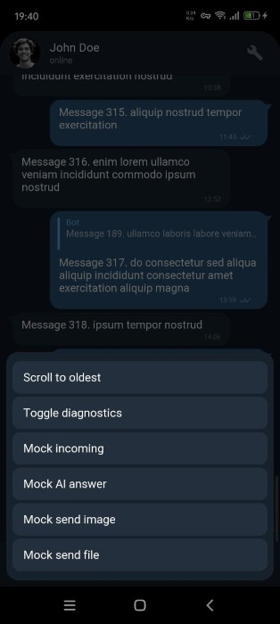

[DrawnUI](https://drawnui.net/)  is a rendering engine built on top of SkiaSharp, usable inside different .NET frameworks like .NET MAUI, Blazor, and others, allowing you to create custom elements drawn on a canvas. This enables pixel-perfect designs and covers scenarios not handled by platform built-in controls.

Once you prepare your UI to be drawn, it runs on MAUI mobile and desktop, Blazor, OpenTK Windows and Linux, and other .NET platforms, looking similarly everywhere since it's all the same code drawing on the appropriate Skia canvas.

<div style="width:100%; max-width:350px; max-height:600px; aspect-ratio: 350 / 600; margin:0 auto;">
  <iframe src="https://chatproto.appomobi.com/" style="width:100%; height:100%; border:0;" loading="lazy"></iframe>
</div>

---

*DrawnUI chat demo, written in C#, runs on a SkiaSharp canvas.*

## CollectionView

The [CollectionView](https://learn.microsoft.com/en-us/dotnet/maui/user-interface/controls/collectionview) .NET MAUI element provides a way to load and display data items by reusing the same views for every item in the source.

Take a product list, for example — each product could be rendered with the same template, showing different values for price, quantity, image, etc. You could have 100 items in a category with only 10 views rendering them, if not fewer.

What if we just put the items stack inside a `ScrollView`? For small data sources this works fine, but imagine a large scrolling list of items consuming mobile device memory: more items = more memory claimed = eventually an out of memory crash, along with “this was working yesterday, today it crashes.”

### Recycled Cells Mechanism

A recycled cells mechanism must be used for data sources with unknown or large size. What you have in memory is:

1. Your loaded data source
2. A limited window of rendered cells (views) required for display

This comes with a cost: the underlying engine must re-compute and re-render cells dynamically during scrolling, since items share the same views. This is the main challenge of any recycled cells implementation, which is why classic `ScrollView` sometimes scrolls more smoothly than recycled implementations like `ListView` or `CollectionView`.

## ObservableCollection

.NET elements working with data sources typically support `ObservableCollection` as a source. This allows them to react to dynamic changes without rebuilding from scratch when the items list partially changes.

This covers the following use cases:

- Set all data at once when available — the most common scenario
- Load more data (pages) as the user scrolls and add to the collection’s end, making it grow. Best for one-directional dynamic sources like news feeds
- Load more data while scrolling in any direction, adding to the appropriate side and removing from the other to keep memory limited. Allows access to unlimited-size data sources like a chat list with millions of entries
- Edit the collection at will with operations like Insert, Replace, Remove. React to small changes without reloading data from scratch

For complex scenarios to work smoothly, a subclass of `ObservableCollection` like `ObservableRangeCollection` is needed to add items in bulk and avoid resetting the collection for operations like bulk range replacement. Many custom implementations exist, but the key difference in a good one is not raising Reset events when modifying existing data.

**Important:** `ObservableCollection` changes must always execute on the main thread by design. In .NET MAUI, wrap code with `MainThread.BeginInvokeOnMainThread`. Never assume code runs on the main thread, especially inside DrawnUI. Note: MAUI requires setting `CollectionView.ItemsSource` on the main thread only; DrawnUI’s `SkiaLayout.ItemsSource` does not require this.

## When to Use DrawnUI for Recycled Cells

Consider a drawn alternative to built-in native controls when:

- **Complex designs requiring pixel-perfect implementation** with different cell templates. One drawn cell can handle multiple templates and render shadows, gradients, and other expensive operations in a single cached layer
- **Custom logic needed** where it’s close to impossible to change internals of platform-dependent framework code. With DrawnUI, write controls from scratch or subclass existing ones — almost every method is virtual and can be overridden for custom logic

DrawnUI handles these scenarios with `SkiaLayout` (with `ItemTemplate` and `ItemsSource` defined) sitting inside `SkiaScroll`. Similar to `BindableLayout` in MAUI (where you define `BindableLayout.ItemTemplate` and `ItemsSource` on a `StackLayout` in a `ScrollView`), the key difference is `SkiaLayout.RecyclingTemplate`. When set to `Enabled`, the scroll and stack combination reaches MAUI `CollectionView` recycling goals.

For a quest for “butter smooth” scrolling, use `SkiaCachedStack` — a dedicated `SkiaLayout` version designed to draw many recycled cells in one pass while scrolling. Normally cells draw one by one as you scroll (fine for few cells on screen), but with many visible cells (like a chat list), rendering a recorded operations cache in one pass is better. This element also uses optional double buffering to avoid lag spikes by preparing the next changed frame in the background.

## Samples

We’ll demonstrate two scenarios:

- **News Feed**: unknown source size, data loaded in chunks while scrolling one direction (LoadMore), uneven row heights, several large cells visible, data kept in memory

- **Chat List**: unknown source size, data loaded in chunks while scrolling both directions (LoadMore), data windowed to stay memory-limited, uneven rows, many small/medium cells visible

## News Feed

A news feed with mixed content (text, images, videos, articles, ads) using recycled cells. Here cells will be recycled at max.


### Handle Uneven Heights with Progressive Measurement

Set `MeasureItemsStrategy="MeasureVisible"` on your `SkiaLayout`:

```xml
<draw:SkiaLayout
    ItemsSource="{Binding NewsItems}"
    RecyclingTemplate="Enabled"
    MeasureItemsStrategy="MeasureVisible"
    ReserveTemplates="10"
    VirtualisationInflated="200" />
```

This measures only visible items initially. Off-screen items measure in the background as the user scrolls. No startup lag even with 1000+ items of varying heights.

### LoadMore: Append, Don't Reset

Use `ObservableRangeCollection` and `AddRange()` to append new chunks:

```csharp
private async Task LoadMore()
{
    var newItems = _dataProvider.GetNewsFeed(50);
    
    MainThread.BeginInvokeOnMainThread(() =>
    {
        NewsItems.AddRange(newItems);  // Append, don't clear
    });
}
```

Wire it to scroll with `LoadMoreOffset="500"` — triggers when user is within 500 points of the end.

### Build One Cell for All Content Types

Subclass `SkiaDynamicDrawnCell` ti have a cell for all possible data cases (image container, text labels, article preview, ad banner, etc.) and control visibility based on the current item's type. All properties will be applied after this method execution finishes, base class locks all cell UI updates while it runs:

```csharp
protected override void SetContent(object ctx)
{
    base.SetContent(ctx);
    
    if (ctx is NewsItem news)
    {
        // Reset visibility first
        TitleLabel.IsVisible = false;
        ContentLabel.IsVisible = false;
        ContentImage.IsVisible = false;
        ArticleLayout.IsVisible = false;
        AdLayout.IsVisible = false;
        
        // Configure common author/time
        AuthorLabel.Text = news.AuthorName;
        TimeLabel.Text = GetRelativeTime(news.PublishedAt);
        
        // Show/hide based on type
        switch (news.Type)
        {
            case NewsType.Text:
                ContentLabel.IsVisible = true;
                ContentLabel.Text = news.Content;
                break;
            case NewsType.Image:
                ContentImage.IsVisible = true;
                ContentImg.Source = news.ImageUrl;
                break;
            case NewsType.Video:
                ContentImage.IsVisible = true;
                VideoLayout.IsVisible = true;
                ContentImg.Source = news.VideoUrl;
                break;
            // ... other types
        }
    }
}
```

With virtual drawn controls, toggling `IsVisible` has zero cost — no native view instantiation, no layout penalty.

For full code and details, see the [tutorial](https://drawnui.net/articles/news-feed-tutorial.html).

## Chat List

This chat simulation loads images from the internet and data from a mock API service. Chat views are vertically flipped to always show the latest message at the bottom with inverted scrolling. It’s built as a totally drawn app, but you could also use a regular MAUI UI and insert a drawn chat list scroll wrapped with a `Canvas`.

The specifics of this example are that loaded data will be limited within a window, ex, 150 items max. The main goal here being scrolling smoothness, proper cells will be created for every item within the limited window, and then reused for different items arriving within. Since drawn cells create no native views they are cheap to keep, and memory usage is defined by the limited window size.  
We also use `SkiaCachedStack` here, which will draw an already recorded cache for scrolling while we calculate newly arriving cells in the background.



All like News Feed, this sample also runs fine not only in .NET MAUI but on the web, appropriate projects are also included in the [sample repo](https://github.com/taublast/DrawnChatList).

From the News Feed example, you already know how to create a drawn recycled list with dynamically changing cell appearance. Here we cover specifics for chat:

- Many differently looking cells
- Reacting to data changes on the fly
- Limited data window
- Inverted scroll
- Scroll to element
- Keyboard offset and focus

### Differently Looking Cells

As in the News Feed sample, a subclassed `SkiaDynamicDrawnCell` is optional but carries useful boilerplate for recycled cells — setting context, watching property changes, etc. In MAUI, native views require platform handler instantiation for each subview; with drawn controls, you use pure drawing logic models. You can switch `IsVisible` freely for sub-elements to compose the right look for the current context (e.g., toggle image banner visibility with zero penalty). This is neither effective nor possible with native control recycled templates.

### Reacting to Data Changes

Users might delete or edit messages, or you might show AI typing a message in real-time. Two main scenarios:

- The collection visually updates when items are inserted or removed
- The cell redraws or collection updates when data context changes

The first case uses `ObservableCollection` — nothing special. For the second, react to property changes in the cell’s data context. The cell `ChatCell : SkiaDynamicDrawnCell` is a `SkiaLayout` subclass with useful boilerplate. Override virtual methods like:

```csharp
protected override void ContextPropertyChanged(object sender, PropertyChangedEventArgs e)
{
    if (e.PropertyName is nameof(ChatMessage.Sent)
        or nameof(ChatMessage.Delivered)
        or nameof(ChatMessage.Read))
    {
        if (Context is ChatMessage msg)
        {
            UpdateStatus(msg); // adjust visuals for status checks
        }
    }
}
```

### Limited Data Window

Like a room shouldn’t hold 1000 people, a control shouldn’t load a million-row data source without limits. You need mechanics to limit the data window while letting the control adapt seamlessly to changed data.

`SkiaScroll` provides two-directional load-more mechanics. Beyond `LoadMoreCommand`, you have `LoadMoreTopCommand` to load missing data in any direction and cut data from the other side using `ObservableRangeCollection` — the ability to change data ranges without resetting `ItemsSource`.

This sample includes helpers like `WindowedCollection`, which works with an underlying `ObservableRangeCollection` to limit loaded data. The chat page adds new items via classic LoadMore commands.

### Inverted Scroll

Chat scrolls usually rotate: new messages arrive at the bottom, scroll aligns to the bottom, you scroll bottom-to-top. Apply transforms and tell the scroll to handle gestures accordingly:

```csharp
Rotation = 180,
ReverseGestures = true,
```

Then rotate `ChatCell` inside the stack back upright so it doesn’t render upside-down:

```csharp
Rotation = 180; // scroll is rotated 180 (inverted chat), rotate cell back upright
```

### Scroll to Element

Chat apps need to scroll to pinned, unread, or marked messages on demand.

### Keyboard Offset and Focus

Users expect the chat to shrink when the on-screen keyboard opens on mobile, while keeping the top nav bar visible. With built-in native behavior, this is sometimes possible, sometimes not. With DrawnUI, all UI logic is under your control. React to keyboard size changes in the chat page and adjust a placeholder under the chat list, while the nav bar stays in place.

Users also expect the keyboard not to close when they press both the UI Send button and the keyboard Send button. DrawnUI handles this correctly.

## Conclusion

We’ve demonstrated a viable drawn alternative to built-in native controls in .NET MAUI (and other platforms where SkiaSharp runs).

DrawnUI continues to evolve, and future built-in elements will cover more use cases like real-time video playback in recycled scrolling cells. Please share additional use cases in the comments below.

## Links and Resources

- [News Feed Tutorial](https://drawnui.net/articles/news-feed-tutorial.html) first sample
- [Drawn Chat List](https://github.com/taublast/DrawnChatList) second sample
- [DrawnUI Site](https://drawnui.net/) site for documentation and examples
- [DrawnUI Repo](https://github.com/taublast/DrawnUi) open-source 
- [MAUI CollectionView](https://learn.microsoft.com/en-us/dotnet/maui/user-interface/controls/collectionview) guide and docs
working sample used in this article
---

*The author is available for consulting and development works on mobile apps and custom controls for .NET. If you need help with custom UI, native interop, or performance work, feel free to [reach out](/about).*
